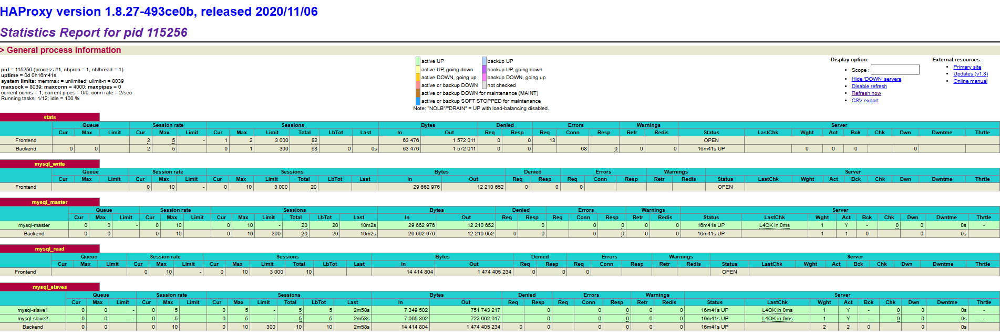

### 목표

- mysql  master 1대, slave 2대로 replication 구성
- **haproxy** + **mysql** 연동
- **HAProxy Stat** 페이지와 **Sysbench 부하 테스트**를 통해 시스템 성능과 트래픽 분산이 올바르게 작동하는지 확인
    - 애플리케이션 로직에서 읽기/쓰기 요청을 3306/3307 포트로 분리해서 요청한다고 가정하고 테스트

### 환경 설정

- KT Cloud
    - MySQL Master 1대, Slave 2대, HAproxy 1대
    - 공인 IP 포트포워딩
- OS: Rocky Linux 8.1
- DB: mysql 8.0.40
- LB: haproxy 1.8.27

## 개념 및 설정

### MySQL

- DB 작업은 쓰기(삽입, 삭제, 수정)는 드물고, 읽기(조회) 작업이 대부분
    - 이를 해소할 수 있는 것이 읽기/쓰기 분리를 적용한 Master-Slave Replication
    - Master에는 모든 작업을 가능하게 설정하고, Slave에는 읽기 작업만 수행
- MySQL의 Binary Log를 이용한 Replication 연동

> `/etc/my.cnf`
> 
- MySQL의 Binary Log, 식별 id, 읽기 전용 여부 등 설정
- Master와 Slave의 id는 달라야 함

### HAproxy

- L7 로드밸런싱도 가능하지만 여기선 L4기능만 사용 IP, Port를 기준으로 로드밸런싱
- 애플리케이션 단에서 분리한 읽기/쓰기 요청을 각각 라우팅

> `/etc/haproxy/haproxy.cfg`
> 
- ip, port를 통해 분리하여 수신한 트래픽을 처리하는 **frontend**
- frontend에서 수신한 트래픽을 ip, port를 통해 로드밸런싱하는 **backend**
    - Slave 서버 간의 로드밸런싱
- Master와 Slave의 연결 상태, 트래픽 분산 모니터링하는 **stat**

## 작업 과정

## **1. MySQL Master 설정**

### 1) Mysql 설치

```bash
useradd -m -G wheel mysqladmin
echo "mysqladmin" | passwd --stdin mysqladmin

sudo dnf update --exclude=kernel* -y
sudo dnf install -y https://dev.mysql.com/get/mysql80-community-release-el8-9.noarch.rpm

# rhel 8 이상은 mysql 기본 모듈이 활성화되어 있어 모듈 리셋
sudo dnf module reset mysql
sudo dnf module disable mysql -y
sudo dnf install -y mysql-community-server

sudo systemctl enable --now mysqld

# 초기화 시 생성되는 임시 비밀번호 출력
sudo grep 'temporary password' /var/log/mysqld.log
# mysql 보안 설치
mysql_secure_installation
```

- 방화벽 설정

```bash
sudo systemctl enable --now firewalld
sudo firewall-cmd --add-port=3306/tcp --permanent
sudo firewall-cmd --reload
```

### 2) MySQL 설정

- Mysql DB, 계정, slave 설정

```sql
mysql -u root -p

CREATE DATABASE replica_db DEFAULT CHARACTER SET utf8;

# 레플리케이션 전용 계정
CREATE USER 'replica_user'@'%' IDENTIFIED BY '<PWD>';
GRANT REPLICATION SLAVE ON *.* TO 'replica_user'@'%';
FLUSH PRIVILEGES;

# 관리자 계정
CREATE USER 'admin_user'@'%' IDENTIFIED BY '<PWD>';
GRANT ALL PRIVILEGES ON *.* TO 'admin_user'@'%' WITH GRANT OPTION;
FLUSH PRIVILEGES;
```

- Mysql Master 설정

```bash
sudo vi /etc/my.cnf

# master와 slave의 이름 통일
log-bin=mysql-bin
# master id을 1로 설정
server-id=1

systemctl restart mysqld
```

- master 서버 정보 확인

```sql
# slave에서 replication 할 때 필요한 값
show master status;
 mysql-bin.000001 | 1833
```

- mysql dump로 binary log를 생성하여 Slave 서버에 전송

```bash
mysqldump -u admin_user -p replica_db > replica_db.sql1
scp -P 22 replica_db.sql mysqladmin@<Slave1 IP>:/home/mysqladmin
scp -P 22 replica_db.sql mysqladmin@<Slave2 IP>:/home/mysqladmin
```

## **2. MySQL Slave1,2 설정**

### 1) Mysql 설치

```bash
useradd -m -G wheel mysqladmin
echo "mysqladmin" | passwd --stdin mysqladmin

sudo dnf update --exclude=kernel* -y
sudo dnf install -y https://dev.mysql.com/get/mysql80-community-release-el8-9.noarch.rpm

# rhel 8 이상은 mysql 기본 모듈이 활성화되어 있어 모듈 리셋
sudo dnf module reset mysql
sudo dnf module disable mysql -y
sudo dnf install -y mysql-community-server

sudo systemctl enable --now mysqld

# 초기화 시 생성되는 임시 비밀번호 출력
sudo grep 'temporary password' /var/log/mysqld.log
# mysql 보안 설치
mysql_secure_installation
```

- 방화벽 설정

```bash
sudo systemctl enable --now firewalld
sudo firewall-cmd --add-port=3306/tcp --permanent
sudo firewall-cmd --reload
```

### 2) Mysql DB

```sql
mysql -u root -p

CREATE DATABASE replica_db DEFAULT CHARACTER SET utf8;
```

- Mysql Slave 설정

```bash
sudo vi /etc/my.cnf

# slave1은 2, slave2는 3으로 설정
server-id = 2
# 읽기 전용으로 설정 (쓰기 불가능, root예외)
read_only = 1
max_binlog_size = 100M
expire_logs_days = 10 
```

- Master에서 전송받은 binary log로 MySQL 복원

```bash
mysql -u root -p replica_db < replica_db.sql
mysql -u root -p
```

- slave에서 master로 연결
- 위의 master에서 show master status; 결과로 나온 log, Position 입력

```sql
change master to
master_host='<Master IP>',
master_user='replica_user',
master_password='<Master PW>',
master_log_file='mysql-bin.000001',
master_log_pos=1833;
```

```bash
systemctl restart mysqld
```

- slave 설정 확인
    - `Slave_IO_Running`/`Slave_SQL_Running` Yes인지 확인
    - `Seconds_Behind_Master`이 0인지 확인

```sql
show slave status\G;

# root 포함 read_only 설정
SET GLOBAL super_read_only = 1;
```

- (선택) `caching_sha2_password` 에러 발생시 조치

```sql
ALTER USER 'replica_user'@'%' IDENTIFIED WITH 'mysql_native_password' BY 'Parjootae2!';
FLUSH PRIVILEGES;
```

## **3. Replication 테스트**

- Master에서 데이터를 추가/변경하여 Slave 서버에서 동기화가 잘 이루어지는지 확인
- Master에서 데이터 생성

```sql
USE replica_db;
CREATE TABLE test_replication (id INT PRIMARY KEY, value VARCHAR(50));
INSERT INTO test_replication (id, value) VALUES (4, 'Replication Test4');
select * from test_replication;
```

- Slave에서 데이터 조회

```sql
USE replica_db;
select * from test_replication;
```

## 4. HAproxy 설정

- haproxy 설치

```bash
useradd -m -G wheel haproxy
echo "haproxy" | passwd --stdin haproxy

sudo dnf update --exclude=kernel* -y
sudo dnf install -y haproxy
```

- haproxy.cfg 설정

```bash
sudo vi /etc/haproxy/haproxy.cfg

# defaults: 이후 section에 적용되는 공통 설정
# frontend: 클라이언트 연결에 관한 설정
# bakend: frontend 에서 접속된 트래픽을 전달할 프록시 서버에 대한 설정 과 HealthCheck 등의 설정
# listen: 프론트엔드와 백엔드의 기능이 결합된 완전한 프록시를 정의
#---------------------
# default tcp
#---------------------
defaults tcp
    mode                    tcp
    log                     global
    option                  tcplog
    retries                 3
    timeout connect         10s
    timeout client          1m
    timeout server          1m
    timeout check           10s
    maxconn                 3000
#-----------------
# haproxy stat 페이지
#-----------------
listen stats
    # 모든 NI에서 9000포트로의 트래픽 수신
    bind *:9000
    mode  http
    option dontlog-normal
    stats enable
    stats refresh 60s
    stats realm Haproxy\ Statistics
    stats uri /haproxy
#---------------------------------------------------------------------
# HAproxy
#---------------------------------------------------------------------
# 위에서 정의한 tcp defaults 사용
defaults tcp
# C/U/D (Master)
frontend mysql_write
    # 모든 NI에서 3306포트로의 트래픽 수신
    bind *:3306
    default_backend mysql_master

backend mysql_master
    balance roundrobin
    option tcp-check
    # 수신한 트래픽을 Master 서버로 라우팅
    server mysql-master <Master IP>:3306 check

# R (Slave)
frontend mysql_read
    # 모든 NI에서 3307포트로의 트래픽 수신
    bind *:3307
    default_backend mysql_slaves

backend mysql_slaves
    balance roundrobin
    option tcp-check
    # 수신한 트래픽을 Slave 서버로 로드밸런싱 하면서 라우팅
    server mysql-slave1 <Slave1 IP>:3306 check
    server mysql-slave2 <Slave2 IP>:3306 check
```

- haproxy 로그 설정

```bash
sudo vi /etc/rsyslog.conf

# HAProxy 로그 설정
local2.*    /var/log/haproxy.log

sudo systemctl restart rsyslog
sudo systemctl restart haproxy
```

- 방화벽 설정

```bash
sudo systemctl enable --now firewalld
# 3306 포트 허용 (쓰기 전용)
sudo firewall-cmd --add-port=3306/tcp --permanent
# 3307 포트 허용 (읽기 전용)
sudo firewall-cmd --add-port=3307/tcp --permanent
# 9000 포트 허용 (스탯)
sudo firewall-cmd --add-port=9000/tcp --permanent
sudo firewall-cmd --reload
```

- haproxy 실행

```bash
sudo systemctl enable --now haproxy

http://<공인 IP>:9000/haproxy
```


## 5. 부하 테스트

- sysbench 설치

```bash
sudo dnf install -y epel-release
sudo dnf install -y sysbench
```

- sysbench 테스트

```bash
CREATE DATABASE test_db;

sysbench --db-driver=mysql --mysql-host=<HAproxy IP> --mysql-port=3306 \
         --mysql-db=test_db oltp_read_write prepare \
         --mysql-user=admin_user --mysql-password=<password>
```

- 쓰기 테스트 (HAProxy 3306 포트, 마스터로 라우팅 확인)

```bash
# oltp_write_only: 쓰기 작업만 수행하여 마스터에 부하가 걸리는지 확인
# time=60: 테스트를 60초 동안 수행
# threads=10: 10개의 쓰레드로 동시에 요청
sysbench --db-driver=mysql --mysql-host=<HAproxy IP> --mysql-port=3306 \\
         --mysql-db=test_db oltp_write_only --time=60 --threads=10 run \\
         --mysql-user=admin_user --mysql-password=<password>
```

- 읽기 테스트 (HAProxy 3307 포트, 슬레이브로 라우팅 확인)

```bash
# **oltp_read_only**: 읽기 작업만 수행하여 슬레이브에 부하가 걸리는지 확인
sysbench --db-driver=mysql --mysql-host=<HAproxy IP> --mysql-port=3307 \
         --mysql-db=test_db oltp_read_only --time=60 --threads=10 run \
         --mysql-user=admin_user --mysql-password=<password>
```

### 결과 분석

- sysbench 결과가 HAproxy stat 페이지에 반영 되는지 확인
- **쓰기 요청은 마스터로, 읽기 요청은 슬레이브로 분배**되는지, 세션 수와 데이터 전송량 등을 확인



---

## 로그 확인

- haproxy 로그 확인

```bash
sudo haproxy -c -f /etc/haproxy/haproxy.cfg
```

## 트러블슈팅

### Replication

> change master to 로 Slave 설정 후 오류
`Last_IO_Error: Authentication plugin 'caching_sha2_password' reported error: Authentication requires secure connection.`
> 
- 마스터에서 사용하는 인증 플러그인(caching_sha2_password)으로 인해 슬레이브가 인증에 실패
- Master에서 기본 인증 플러그인이 `caching_sha2_password`로 설정된 경우 발생할 수 있다. Slave는 기본적으로 `mysql_native_password` 플러그인을 사용하므로, 인증 불일치 문제 발생
- 계정 인증 방식을 변경하고 재시작 필요

```sql
# Master
ALTER USER 'replica_user'@'%' IDENTIFIED WITH 'mysql_native_password' BY '<비밀번호>';
FLUSH PRIVILEGES;

# Slave
STOP SLAVE;
START SLAVE;
```

> Slave에서 my.cnf의 read_only 설정은 root를 제외한 제약이다.
> 
- 만약 root로 데이터를 생성하면 replication 설정이 끊김
- `SET GLOBAL super_read_only = 1;` 를 MySQL에서 입력해 root를 포함해 읽기 전용 설정

### HAproxy

> haproxy.cfg의 defaults는 사용 전 정의
> 
- listen, front/backend 부분에 tcp를 사용중인데 defaults가 http만 있다면 에러가 발생

> haproxy.cfg에서 defaults는 listen, front/backend보다 상위에 위치해야 함
> 
- haproxy stats 모니터링 시에 sysbench로 테스트한 내용이 반영이 안되는 문제 발생
- defaults tcp가 listen stat보다 아래에 위치해서 제대로 반영되지 않았기 때문

---

## 참고

mysql 설치:
https://www.servermon.kr/m/board.html?code=servermon_board2&page=3&type=v&board_cate=&num1=999619&num2=00000&number=363&lock=N

mysql replication: 
https://wooj-coding-fordeveloper.tistory.com/63
https://www.didim365.com/blog/20200424b-blog/

haproxy:
https://velog.io/@parrineau/MySQL-HAproxy-MHA

haproxy 상세:
https://hoing.io/archives/2196