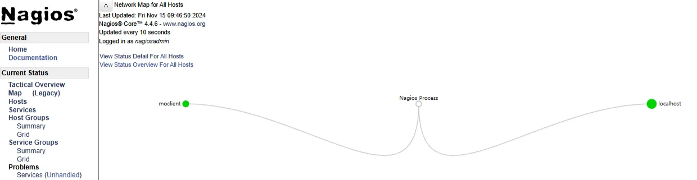
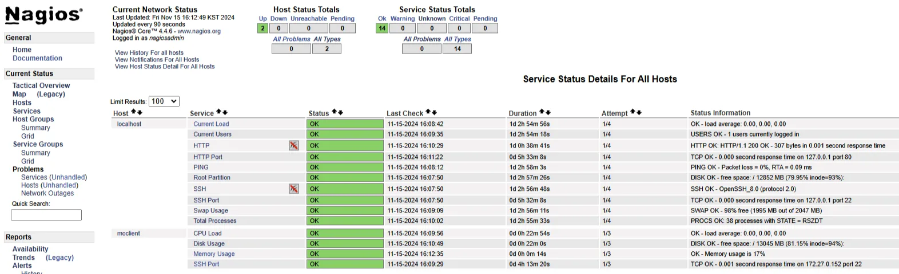

### 목표

- Nagios 서버 클라이언트 시스템 모니터링 환경 구성
- NRPE와 check_tcp 플러그인을 활용한 포트 및 기본 시스템 리소스 모니터링 구현
- Nagios 웹 인터페이스를 통한 모니터링 결과 시각화
- 커스텀 플러그인 작성을 통한 특정 메모리 모니터링 기능 추가
- Nagios 서버에서 bastion 노드를 거쳐 private 노드 모니터링

### 환경 설정

- KT Cloud
    - Nagios Server 1대, Client 1대, Private Client 1대
    - 공인 IP 포트포워딩
- OS: Rocky Linux 8.1
- Monitoring: nagios 4.4.6, nagios-plugins 2.2.1, nrpe 4.1.0

## 개념 및 설정

### Nagios

> `/usr/local/nagios/var/nagios.log`
> 
- 메인 로그 파일
- 웹에서 alerts history, notifications, Event log가 이 파일 참조

> `/usr/local/nagios/etc/nagios.cfg`
> 
- 메인 설정 파일

> `/usr/local/nagios/etc/objects/localhost.cfg`
> 
- 로컬호스트 설정 파일

> `/usr/local/nagios/etc/objects/commands.cfg`
> 
- 설정 파일에서 사용하는 command 정의 파일

> `/usr/local/nagios/libexec/`
> 
- command의 실제 쉘 스크립트가 저장되어 있는 경로

### NRPE

> `/etc/nagios/nrpe.cfg`
> 
- 서버와의 연결 설정
- 클라이언트에서 사용할 `/usr/local/nagios/libexec/` 경로의 플러그인 스크립트를 command로 지정


### NRPE 플러그인 적용 흐름

```bash
# 아래 파일들을 참조해 check_nrpe!check_load가 동작 가능
# 서버 client.cfg 
define service {
    use                     generic-service
    host_name               moclient
    service_description     CPU Load
    check_command           check_nrpe!check_load
}

# checp_nrpe는 아래 경로 참조
# 서버 commands.cfg
define command {
	command_name    check_nrpe
	command_line    /usr/local/nagios/libexec/check_nrpe -H $HOSTADDRESS$ -c $ARG1$
}

# check_load는 아래 경로 참조
# 클라이언트 nrpe.cfg
command[check_load]=/usr/local/nagios/libexec/check_load -r -w .15,.10,.05 -c .30,.25,.20
```

---

## 작업 과정

### 1. Nagios Server 설정

- 사용자 생성

```bash
useradd -m -G wheel moserver
echo "moserver" | passwd --stdin moserver
```

- 소스 설치 준비

```bash
sudo dnf update --exclude=kernel* -y
sudo dnf install -y httpd httpd-tools php gcc glibc glibc-common gd gd-devel make net-snmp
```

- 유저, 그룹 생성
    - nagios 유저 없으면 make install 에서 오류
    - 위에서 설치한 httpd 사용자 apache 유저에게 nagios 접근 권한을 nagcmd 그룹으로 부여
        - nagios 웹 인터페이스에서 nagios 작업할 때 apache가 nagios 외부 파일에 접근해야 함

```bash
sudo groupadd nagcmd
sudo useradd nagios

sudo usermod -G nagcmd nagios
sudo usermod -G nagcmd apache
```

- nagios 패키지 다운로드
    - nagios, nagios 플러그인 패키지 다운로드

```bash
mkdir /home/moserver/nagios && cd /home/moserver/nagios

sudo wget https://assets.nagios.com/downloads/nagioscore/releases/nagios-4.4.6.tar.gz
sudo wget https://nagios-plugins.org/download/nagios-plugins-2.2.1.tar.gz

sudo tar -xvf nagios-4.4.6.tar.gz
sudo tar -xvf nagios-plugins-2.2.1.tar.gz
```

### 1) Nagios 소스 설치

```bash
cd nagios-4.4.6/
# 소스파일에 대한 환경설정을 해주는 명령어. 서버환경에 맞춰 makefile 생성
sudo ./configure --with-command-group=nagcmd
# 소스 컴파일
sudo make all
# 컴파일한 소스 설치
sudo make install

# /etc/init.d 에 등록됨
sudo make install-init
# nagios라는 user가 없으면 여기서 에러 발생
sudo make install-commandmode
# /usr/local/nagios 에 설정파일이 생성됨
sudo make install-config
```

- nagios 웹 인터페이스

```bash
# /etc/httpd/conf.d/nagios.conf 생성됨
sudo make install-webconf

sudo htpasswd -s -c /usr/local/nagios/etc/htpasswd.users nagiosadmin

sudo systemctl enable --now httpd
sudo systemctl enable --now nagios
```

- 방화벽 설정

```bash
sudo systemctl enable --now firewalld
sudo firewall-cmd --add-port=80/tcp --permanent
sudo firewall-cmd --reload
```

- (선택) 이메일 알림

```bash
vi /usr/local/nagios/etc/objects/contacts.cfg
```

- 웹 인터페이스 접근

```bash
http://<domain>:8080/nagios/
```

- 플러그인 설치 안하면 critical로 표시됨


### 2) Nagios 플러그인 소스 설치

```bash
cd /home/moserver/nagios/nagios-plugins-2.2.1/

# 소스파일에 대한 환경설정을 해주는 명령어. 서버환경에 맞춰 makefile 생성
sudo ./configure --with-nagios-user=nagios --with-nagios-group=nagios
# 소스 컴파일
sudo make all
# 컴파일한 소스 설치
sudo make install

# nagios 설정 파일 검사
sudo /usr/local/nagios/bin/nagios -v /usr/local/nagios/etc/nagios.cfg
```

- index.html 생성

```bash
echo "http check" | sudo tee /var/www/html/index.html
```

- nagios 재시작

```bash
sudo systemctl restart nagios
sudo systemctl restart httpd
```

- 플러그인 반영까지 수 분 소요


## 2. Nagios Client 설정

### 1) Server NRPE 소스 설치

```bash
sudo cd /home/moserver/nagios

sudo wget https://github.com/NagiosEnterprises/nrpe/releases/download/nrpe-4.1.0/nrpe-4.1.0.tar.gz

sudo tar zxvf nrpe-4.1.0.tar.gz

sudo cd nrpe-4.1.0
# -–enable-command-args 옵션을 사용하면 NRPE를 통해 인수를 전달할 수 있습니다. 
# 생략하면 인수를 nrpe 구성 파일 nrpe.cfg에 명시적으로 설정해야 합니다.
# -–with-nrpe-user=nagios –with-nrpe-group=nagios는 구성 파일의 소유권을 설정합니다.
sudo ./configure --enable-command-args --with-nrpe-user=nagios --with-nrpe-group=nagios

sudo make install-groups-users
sudo make all
sudo make install
```

- 방화벽 설정

```bash
sudo firewall-cmd --add-port=5666/tcp --permanent
sudo firewall-cmd --reload
```

- nrpe 설정

```bash
sudo vi /usr/local/nagios/etc/nagios.cfg
# 주석 제거
cfg_dir=/usr/local/nagios/etc/servers
 
sudo mkdir -p /usr/local/nagios/etc/servers
sudo vi /usr/local/nagios/etc/servers/client.cfg

define host{

   use                   linux-server
   host_name             moclient
   alias                 moclient
   address               <Client-IP>
   max_check_attempts    5
   check_period          24x7
   notification_interval 30
   notification_period   24x7
}

sudo systemctl enable --now nrpe
```

### 2) Client NRPE 설정

- 사용자 생성

```bash
useradd -m -G wheel moclient
echo "moclient" | passwd --stdin moclient
```

```bash
sudo dnf install -y nrpe 
```

- nrpe 설정

```bash
sudo vi /etc/nagios/nrpe.cfg
 allowed_hosts=127.0.0.1,::1,<Server IP>
 
sudo systemctl enable --now nrpe
```

### 3) Client Nagios 플러그인 소스  설치

- 소스 설치 준비

```bash
sudo dnf update --exclude=kernel* -y
sudo dnf install -y httpd httpd-tools php gcc glibc glibc-common gd gd-devel make net-snmp
```

- nagios 플러그인 패키지 다운로드

```bash
mkdir /home/moclient/nagios && cd /home/moclient/nagios

sudo wget https://nagios-plugins.org/download/nagios-plugins-2.2.1.tar.gz

sudo tar -xvf nagios-plugins-2.2.1.tar.gz
```

```bash
cd /home/moclient/nagios/nagios-plugins-2.2.1/

# 소스파일에 대한 환경설정을 해주는 명령어. 서버환경에 맞춰 makefile 생성
sudo ./configure --with-nagios-user=nagios --with-nagios-group=nagios
# 소스 컴파일
sudo make all
# 컴파일한 소스 설치
sudo make install
```

- 방화벽 설정

```bash
sudo systemctl enable --now firewalld
sudo firewall-cmd --add-port=5666/tcp --permanent

sudo firewall-cmd --reload
```




## 3. Nagios 모니터링 추가 설정

### 1) Server local check_tcp 모니터링 추가

- period, max_check_attemps 등 명시 안하면 `templates.cfg` 에 명시된 기본값 사용됨

```bash
sudo vi /usr/local/nagios/etc/objects/localhost.cfg 

define service {
    use                     local-service
    host_name               localhost
    service_description     HTTP Port
    check_command           check_tcp!80
}

define service {
    use                     local-service
    host_name               localhost
    service_description     SSH Port
    check_command           check_tcp!22
}
```

- service에서 HTTP Port, SSH Port 항목 OK 확인


### 2) Client 여러 서비스 모니터링 추가

- Server에서 check_nrpe 플러그인 command 등록

```bash
sudo vi /usr/local/nagios/etc/objects/commands.cfg

define command {
    command_name    check_nrpe
    command_line    /usr/local/nagios/libexec/check_nrpe -H $HOSTADDRESS$ -c $ARG1$
}
```

- Server의 client.cfg

```bash
sudo vi /usr/local/nagios/etc/servers/client.cfg

define service {
    use                     generic-service
    host_name               moclient
    service_description     CPU Load
    check_command           check_nrpe!check_load
}

define service {
    use                     generic-service
    host_name               moclient
    service_description     Disk Usage
    check_command           check_nrpe!check_disk
}

define service {
    use                     generic-service
    host_name               moclient
    service_description     Memory Usage
    check_command           check_nrpe!check_mem
}

define service {
    use                     generic-service
    host_name               moclient
    service_description     SSH Port
    check_command           check_tcp!22
}
```

- Client의 nrpe.cfg

```bash
sudo vi /etc/nagios/nrpe.cfg

command[check_load]=/usr/local/nagios/libexec/check_load -r -w .15,.10,.05 -c .30,.25,.20
command[check_disk]=/usr/local/nagios/libexec/check_disk -w 20% -c 10% -p /
# 커스텀 플러그인
command[check_mem]=/usr/local/nagios/libexec/custom_check_mem 80 90
```

- custom_check_mem 플러그인 커스텀

```bash
sudo vi /usr/local/nagios/libexec/custom_check_mem

#!/bin/bash
# Memory check script for Nagios

# Set warning and critical thresholds
WARN=$1
CRIT=$2

# Get total and free memory
TOTAL_MEM=$(free -m | grep Mem: | awk '{print $2}')
USED_MEM=$(free -m | grep Mem: | awk '{print $3}')
USED_MEM_PERCENT=$((USED_MEM * 100 / TOTAL_MEM))

if [ "$USED_MEM_PERCENT" -ge "$CRIT" ]; then
    echo "CRITICAL - Memory usage is ${USED_MEM_PERCENT}% | memory=${USED_MEM_PERCENT}%"
    exit 2
elif [ "$USED_MEM_PERCENT" -ge "$WARN" ]; then
    echo "WARNING - Memory usage is ${USED_MEM_PERCENT}% | memory=${USED_MEM_PERCENT}%"
    exit 1
else
    echo "OK - Memory usage is ${USED_MEM_PERCENT}% | memory=${USED_MEM_PERCENT}%"
    exit 0
fi

sudo chmod +x /usr/local/nagios/libexec/custom_check_mem
sudo systemctl restart nrpe
```




## 4. Private Host 모니터링

### 1) Private NRPE 설정

- 서버에서 ssh 접속

```bash
ssh root@<Private IP>
```

- 사용자 생성

```bash
useradd -m -G wheel moprivate
echo "moprivate" | passwd --stdin moprivate
```

```bash
sudo dnf update --exclude=kernel* -y
sudo dnf install -y epel-release
sudo dnf install -y nrpe 
```

- nrpe 설정

```bash
sudo vi /etc/nagios/nrpe.cfg
 allowed_hosts=127.0.0.1,::1,<Server IP>
 
sudo systemctl enable --now nrpe
```

### 2) Private Nagios 플러그인 소스  설치

- 소스 설치 준비

```bash
sudo dnf install -y httpd httpd-tools php gcc glibc glibc-common gd gd-devel make net-snmp
```

- nagios 플러그인 패키지 다운로드

```bash
mkdir /home/moprivate/nagios && cd /home/moprivate/nagios

sudo wget https://nagios-plugins.org/download/nagios-plugins-2.2.1.tar.gz

sudo tar -xvf nagios-plugins-2.2.1.tar.gz
```

```bash
cd /home/moprivate/nagios/nagios-plugins-2.2.1/

# 소스파일에 대한 환경설정을 해주는 명령어. 서버환경에 맞춰 makefile 생성
sudo ./configure --with-nagios-user=nagios --with-nagios-group=nagios
# 소스 컴파일
sudo make all
# 컴파일한 소스 설치
sudo make install
```

- 방화벽 설정

```bash
sudo systemctl enable --now firewalld
sudo firewall-cmd --add-port=5666/tcp --permanent

sudo firewall-cmd --reload
```

### 3) Server Private 등록

- 서버에 private host 설정

```bash
sudo vi /usr/local/nagios/etc/servers/private.cfg

define host{

   use                   linux-server
   host_name             moprivate
   alias                 moprivate
   address               <Private IP>
   max_check_attempts    5
   check_period          24x7
   notification_interval 30
   notification_period   24x7
}

sudo systemctl enable --now nagios
```

### 4) Private 모니터링 등록

- Server의 client.cfg

```bash
sudo vi /usr/local/nagios/etc/servers/private.cfg

define service {
    use                     generic-service
    host_name               moprivate
    service_description     CPU Load
    check_command           check_nrpe!check_load
}

define service {
    use                     generic-service
    host_name               moprivate
    service_description     Disk Usage
    check_command           check_nrpe!check_disk
}

define service {
    use                     generic-service
    host_name               moprivate
    service_description     Memory Usage
    check_command           check_nrpe!check_mem
}

define service {
    use                     generic-service
    host_name               moprivate
    service_description     SSH Port
    check_command           check_tcp!22
}

sudo systemctl restart nrpe
```

- Private 의 nrpe.cfg

```bash
sudo vi /etc/nagios/nrpe.cfg

command[check_load]=/usr/local/nagios/libexec/check_load -r -w .15,.10,.05 -c .30,.25,.20
command[check_disk]=/usr/local/nagios/libexec/check_disk -w 20% -c 10% -p /
# 커스텀 플러그인
command[check_mem]=/usr/local/nagios/libexec/custom_check_mem 80 90
```

- custom_check_mem 플러그인 커스텀

```bash
sudo vi /usr/local/nagios/libexec/custom_check_mem

#!/bin/bash
# Memory check script for Nagios

# Set warning and critical thresholds
WARN=$1
CRIT=$2

# Get total and free memory
TOTAL_MEM=$(free -m | grep Mem: | awk '{print $2}')
USED_MEM=$(free -m | grep Mem: | awk '{print $3}')
USED_MEM_PERCENT=$((USED_MEM * 100 / TOTAL_MEM))

if [ "$USED_MEM_PERCENT" -ge "$CRIT" ]; then
    echo "CRITICAL - Memory usage is ${USED_MEM_PERCENT}% | memory=${USED_MEM_PERCENT}%"
    exit 2
elif [ "$USED_MEM_PERCENT" -ge "$WARN" ]; then
    echo "WARNING - Memory usage is ${USED_MEM_PERCENT}% | memory=${USED_MEM_PERCENT}%"
    exit 1
else
    echo "OK - Memory usage is ${USED_MEM_PERCENT}% | memory=${USED_MEM_PERCENT}%"
    exit 0
fi

sudo chmod +x /usr/local/nagios/libexec/custom_check_mem
sudo systemctl restart nrpe
```

- 임의로 스트레스 주입


- private host에서 uptime 시에 0.00, 0.02, 0.11이 나왔기 때문에 설정한 15분 평균 0.05보다 크므로 warning 발생

## 5. 회사 플러그인 추가

- Server의 private.cfg

```bash
sudo vi /usr/local/nagios/etc/servers/private.cfg

define service {
    use                     generic-service
    host_name               moprivate
    service_description     Ncloud24 CPU Usage
    check_command           check_nrpe!check_cpu_usage
}

define service {
    use                     generic-service
    host_name               moprivate
    service_description     Ncloud24 MEM Usage
    check_command           check_nrpe!check_mem_usage
}

sudo systemctl restart nagios
```

- Private에서 플러그인 설치

```bash
wget http://service.ncloud24.com/app/nagios/check_mem.pl
wget http://service.ncloud24.com/app/nagios/check_stats.pl
sudo mv check_mem.pl /usr/local/nagios/libexec/
sudo mv check_stats.pl /usr/local/nagios/libexec/
sudo chmod 755 /usr/local/nagios/libexec/check_mem.pl
sudo chmod 755 /usr/local/nagios/libexec/check_stats.pl

sudo vi /usr/local/nagios/libexec/check_stats.pl

# 플러그인 경로 추가
use lib "/usr/local/nagios/libexec";

sudo yum install perl-Sys-Statistics-Linux -y
```

- Private 의 nrpe.cfg

```bash
sudo vi /etc/nagios/nrpe.cfg

# 회사 플러그인
command[check_cpu_usage]=/usr/local/nagios/libexec/check_stats.pl -C -w 90 -c 95
command[check_mem_usage]=/usr/local/nagios/libexec/check_mem.pl -u -C -w 85 -c 90

sudo systemctl restart nrpe
```


---

## 트러블슈팅

### Nagios

> nagios 웹 인터페이스 services - HTTP warning 표시
> 
> 
> HTTP WARNING: HTTP/1.1 403 Forbidden - 7928 bytes in 0.001 second response time 
> 
- HTTP status는 `/usr/local/nagios/etc/objects/localhost.cfg` 의 `check_http`가 관리
    - `/var/www/html/` 경로에 파일이 없어서 못읽기 때문
    - `check_http`는 nagios 사용자 권한으로 Apache에 접근하기 때문에 `index.html`페이지가 없을 때 나오는 `Apache 기본 페이지`를 제공받지 못하고 `403 오류` 반환
        - index.html 생성으로 해결

> 브라우저에서 http://<domain>:8080/ 이 경로는 timeout 오류
> 
- 도메인을 Apache의 `virtualhost` `servername`에 등록하지 않은 경우 도메인을 처리할 수 없음
- 하지만 check_http!-H <domain> -u / 이건 정상 작동
    - 도메인을 Apache에서 해석하냐, Nagios에서 해석하냐의 차이

### NRPE

> `dnf install nrpe` 실행 시 클라이언트용 nrpe만 설치 되고 check_nrpe 플러그인은 설치되지 않음
> 
- nrpe 소스 설치

> 클라이언트의 서비스 모니터링 작성 시 UNKNOWN / NRPE: Unable to read output 오류
> 
- nrpe 설치 시 경로는 /usr/local
- nrpe.cfg 파일의 command 경로를 `/usr/lib64/nagios/plugins/`에서 `/usr/local/nagios/libexec/`로 수정

### 회사 플러그인 추가

> 회사 플러그인 check_stats.pl 추가 후 실행 시 `Can't locate utils.pm in @INC (you may need to install the utils module) (@INC contains: /usr/lib64/nagios/plugins /usr/local/lib64/perl5 /usr/local/share/perl5 /usr/lib64/perl5/vendor_perl /usr/share/perl5/vendor_perl /usr/lib64/perl5 /usr/share/perl5) at /usr/local/nagios/libexec/check_stats.pl line 33.`
> 
- 내가 설치한 플러그인들의 경로가 `/usr/local/nagios/libexec` 이기 때문에 check_stats.pl에서 해당 경로를 찾지 못했기 때문에 발생한 문제
    - 경로 수정 없이 플러그인 설치했는데 다른 사람들과 플러그인 경로가 다름
        - 소스 설치 경로는 `/usr/local/nagios/libexec`
        - 패키지 설치 경로는 `/usr/lib64/nagios/plugins`
            - 소스 설치 시 `./configure --libexecdir=/usr/lib64/nagios/plugins` 명령어로 경로 수정 가능
    - 플러그인에 경로 추가로 해결

> 위 경로 추가 후 재실행 시 `Can't locate Sys/Statistics/Linux.pm in @INC (you may need to install the Sys::Statistics::Linux module) (@INC contains: /usr/local/nagios/libexec /usr/lib64/nagios/plugins /usr/local/lib64/perl5 /usr/local/share/perl5 /usr/lib64/perl5/vendor_perl /usr/share/perl5/vendor_perl /usr/lib64/perl5 /usr/share/perl5) at /usr/local/nagios/libexec/check_stats.pl line 37.`
> 
- Sys:Statistics::Linux 모듈이 없기 때문에 발생한 오류
    - sudo yum install perl-Sys-Statistics-Linux -y 설치 후 해결

## 참고

nagios 설치:
https://wiki.crowncloud.net/?how_to_install_nagios_on_rockylinux8
상세 해설: 
[https://www.oss.kr/storage/app/public/oss/22/df/[Nagios] Solution Guide V0.95.pdf](https://www.oss.kr/storage/app/public/oss/22/df/%5BNagios%5D%20Solution%20Guide%20V0.95.pdf)

nrpe 설치:
https://kifarunix.com/how-to-install-nagios-nrpe-agent-on-rhel-centos-oracle-linux/