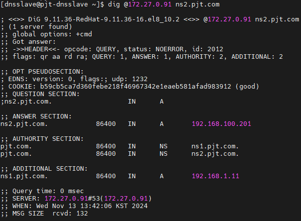

### 목표

- DNS master slave 구조로 네임서버 구성
    - DNS 서버 고가용성 및 부하분산
- 도메인 하나 IP 변경했을때 정상적으로 변경돼서 나오는 지 확인

### 환경 설정

- KT Cloud
    - DNS Master 1대, Slave 1대
    - 공인 IP 포트포워딩
- OS: Rocky Linux 8.1

## 개념 및 설정

> `/etc/named.conf`
> 
- DNS 메인 설정 파일
- `named.rfc1912.zones` 파일 지정
- 포워딩(forwarding) 및 캐싱 정책 설정
- ACL 및 보안 관련 정책 정의

> `/etc/named.rfc1912.zones`
> 
- 로컬 도메인 및 내부 네트워크용 기본 샘플 존 설정 파일
- 도메인 등록 (`pjt.com`)
- zone 파일 지정 (`pjt.com.zone`)
- 각 서버에서 Master/Slave 연동 설정

> `/var/named/pjt.com.zone`
> 
- DNS 레코드 설정
- 주 네임서버는 zone 데이터의 원본을 관리
    - zone 데이터는 다른 권한 있는 네임서버로 복사됨
- 권한 있는 네임서버는 도메인의 레코드 정보를 제공
- Serial 값이 변경(증가)되면 Slave의 `slaves/pjt.com.zone`과 동기화

> `/var/named/slaves/pjt.com.zone`
> 
- `pjt.com` 도메인의 Slave 존 파일
- Master의 `pjt.com.zone`에서 데이터를 복제

### DNS 레코드 유형

| 레코드 유형 | 설명 | 형식 | 예시 |
| --- | --- | --- | --- |
| **NS** | 도메인에 대한 권한을 가진 네임서버를 정의 | `<domain> IN NS <nameserver>` | `@ IN NS ns1.example.com.` |
| **A** | 도메인 이름을 IPv4 주소와 매핑 | `<hostname> IN A <IPv4 address>` | `@ IN A 192.168.1.10` |
| **AAAA** | 도메인 이름을 IPv6 주소와 매핑 | `<hostname> IN AAAA <IPv6 address>` | `www IN AAAA 2001:0db8:85a3::8a2e:0370:7334` |
| **CNAME** | 도메인 이름에 대한 별칭을 설정 | `<alias> IN CNAME <canonical name>` | `mail IN CNAME www.example.com.` |
| **MX** | 메일 서버를 정의하며, 우선순위는 preference로 결정 | `<domain> IN MX <preference> <mail server>` | `@ IN MX 10 mail.example.com.` |
| **TXT** | 도메인에 대한 텍스트 정보를 저장 | `<domain> IN TXT "<text>"` | `@ IN TXT "v=spf1 ip4:192.168.1.0/24 -all"` |
| **PTR** | IP 주소를 도메인 이름으로 매핑 (Reverse DNS) | `<IP-in-reverse>.in-addr.arpa. IN PTR <domain>` | `10.1.168.192.in-addr.arpa. IN PTR example.com.` |
| **SRV** | 특정 서비스의 위치를 정의 | `<service>.<protocol>.<domain> IN SRV <priority> <weight> <port> <target>` | `_sip._tcp.example.com. IN SRV 10 60 5060 sipserver.example.com.` |

## 작업 과정

## 1. DNS Master 설정

- 사용자 생성

```bash
useradd -m -G wheel dnsmaster
echo "dnsmaster" | passwd --stdin dnsmaster
```

- bind 설치

```bash
sudo dnf update --exclude=kernel* -y
sudo dnf install -y bind bind-chroot bind-utils
```

- 방화벽 설정

```bash
sudo systemctl enable --now firewalld
sudo firewall-cmd --add-port=53/tcp --permanent
sudo firewall-cmd --reload
```

### 1) named.conf 수정

- dns로 접근할 수 있도록 `any`로 수정

```bash
sudo vi /etc/named.conf

options {
        listen-on port 53 { any; };
        ...
        allow-query     { any; };
```

### 2) named.rfc1912.zones에 zone 등록

- dns에 zone 파일 등록

```bash
sudo vi /etc/named.rfc1912.zones

zone "pjt.com" IN {
    type master;
    # Zone 파일 경로. /var/named 밑에 저장됨
    file "pjt.com.zone";
    also-notify { <Slave IP>; };
};
```

### 3) zone 파일 생성

- zone 업데이트 시 serial 값이 증가해야 slave에 반영

```bash
sudo vi /var/named/pjt.com.zone

# Primary NS: ns1.pjt.com
# Email: admin.pjt.com. 관리자 이메일 주소 (`@`는 `.`으로 표기. 실제: admin@pjt.com)
$TTL 86400         ; 1일
@   IN  SOA  ns1.pjt.com. admin.pjt.com. (
        2024111301 ; Serial. Zone 파일의 버전 번호. 이 번호가 변경될 때 Slave 서버가 Zone 파일을 동기화
        3600       ; Refresh (1시간). Slave 서버가 Master 서버로부터 Zone 데이터를 주기적으로 업데이트하는 주기
        1800       ; Retry (30분). Slave 서버가 Master 서버와 연결에 실패했을 때 재시도하는 주기
        1209600    ; Expire (2주). Master 서버와 연결이 되지 않을 때 Slave 서버가 Zone 정보를 유효하게 유지할 기간
        86400      ; Minimum TTL (1일). Negative caching을 위한 기본 TTL 값
    )

# Authorized NS(네임서버) 설정
@       IN  NS      ns1.pjt.com.
@       IN  NS      ns2.pjt.com.

# A 레코드 설정 pjt.com / www.pjt.com
@       IN  A       192.168.1.10
www     IN  A       192.168.1.10

# 네임서버 A 레코드 ns1.pjt.com / ns2.pjt.com
ns1     IN  A       192.168.1.10
ns2     IN  A       192.168.100.100
```

- dns 파일 검증

```bash
## named.conf 파일 검증
named-checkconf /etc/named.conf

## zone 파일 검증
#named-checkzone [domain] [zone file]
named-checkzone nirsa.com nirsa.zone
```

- dns 재시작

```bash
sudo named-checkconf
sudo named-checkzone pjt.com /var/named/pjt.com.zone
sudo systemctl restart named
```

## 2. DNS Slave 설정

- 사용자 생성

```bash
useradd -m -G wheel dnsslave
echo "dnsslave" | passwd --stdin dnsslave
```

- bind 설치

```bash
sudo dnf update --exclude=kernel* -y
sudo dnf install -y bind bind-chroot bind-utils
```

- 방화벽 설정

```bash
sudo systemctl enable --now firewalld
sudo firewall-cmd --add-port=53/tcp --permanent
sudo firewall-cmd --reload
```

### 1) named.conf 수정

- dns로 접근할 수 있도록 `any`로 수정

```bash
sudo vi /etc/named.conf

options {
        listen-on port 53 { any; };
        ...
        allow-query     { any; };
```

### 2) named.rfc1912.zones에 zone 등록

- dns에 zone 파일 등록

```bash
sudo vi /etc/named.rfc1912.zones

zone "pjt.com" IN {
    type slave;
    # Zone 파일 경로. /var/named 밑에 저장됨
    file "slaves/pjt.com.zone";
    masters { <Master IP>; };
};
```

- slave 파일 경로 생성

```bash
sudo mkdir -p /var/named/slaves
```

- dns 시작

```bash
sudo named-checkconf
sudo systemctl enable --now named
```

- master-slave 동기화 확인

```bash
sudo ls -l /var/named/slaves
```

## 3. DNS 테스트

- dig 명령어로 dns 쿼리

```bash
dig @<Master IP> pjt.com
dig @<Slave IP> pjt.com

dig @<Slave IP> ns1.pjt.com
```


### 1) IP 변경 후 테스트

- pjt.com.zone 파일 `serial` 넘버 변경
- ns2.pjt.com ip 변경

```bash
sudo vi /var/named/pjt.com.zone

dig @<Slave IP> ns2.pjt.com
```



---

## 트러블슈팅

> `named.con`f의 listen 기본값은 127.0.0.1이다.
> 
- master-slave 구성 후 slave에서 `/var/named/slaves`에 zone 파일 동기화되지 불가
- `/var/log/messages` 확인 결과 `failed to connect: connection refused`가 발생
- named.conf의 listen on이 로컬호스트인 127.0.0.1 설정되어 있어 any로 변경하여 해결

> `named.conf`의 `allow-transfer` 설정은 Serial 값이 변경되어도 Slave에 즉각적으로 동기화하지 않음
> 
- ip 변경 후 Serial 넘버 변경(증가)해도 slave에 반영이 안되는 문제가 발생
- 조사해보니, `allow-transfer`은 Master-Slave 연동을 허용하기만 하는 설정이고, 동기화 시기는 `.zone` 파일의 SOA 레코드의 `refresh` 설정에 따라 달라짐
- `allow-transfer` 대신 serial변경 후 slave에 즉각적으로 알려주는 `also-notify`로 변경하여 해결
    - `also-notify` 설정이 되어 있다면 `refresh`가 쓸모 없다고 생각할 수 있음
        - 그래도 `refresh`는 Serial 값 변경 시 장애가 발생했을 때를 위한 백업 설정으로 여전히 유효

## 참고

https://m.blog.naver.com/host365/222983239445

https://nirsa.tistory.com/128

also-notify 설정: 
[https://bono915.tistory.com/entry/Linux-named-DNS-MasterSlave-서버-구축-및-동기화-설정-방법](https://bono915.tistory.com/entry/Linux-named-DNS-MasterSlave-%EC%84%9C%EB%B2%84-%EA%B5%AC%EC%B6%95-%EB%B0%8F-%EB%8F%99%EA%B8%B0%ED%99%94-%EC%84%A4%EC%A0%95-%EB%B0%A9%EB%B2%95)