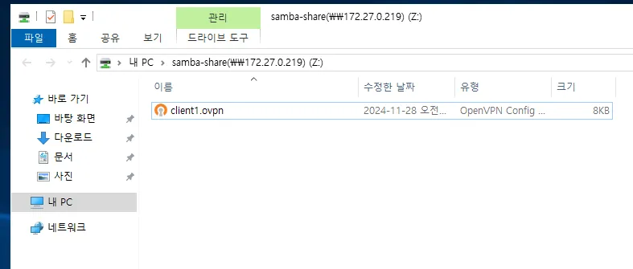
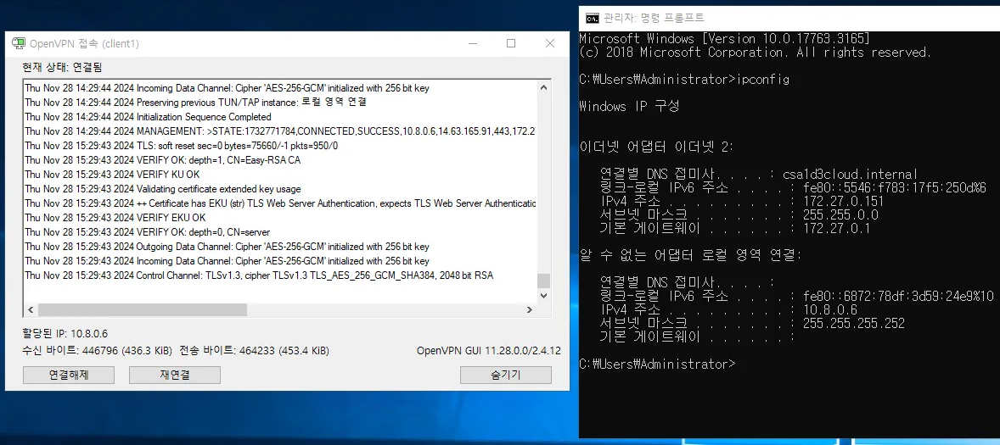
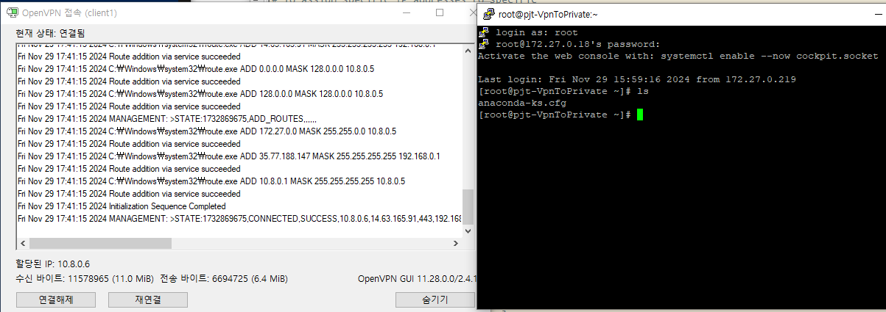

### 목표

- Linux 서버에 OpenVPN 서버를 구축
- OpenVPN 클라이언트와 서버 간의 연결 테스트 수행
    - 서버와 동일한 랜(KT)의 윈도우에서 연결
    - 윈도우 호스트(내 컴퓨터)에서 연결
    - AWS 리눅스(외부 서브넷)에서 연결
- 연결 후 VPN 서버와 동일한 랜의 리눅스로 SSH

### 환경 설정

- OS
    - Rocky 8.10
    - AL 2023
    - Window 2019
- VPN: openvpn 2.4.12

## 개념 및 설정

### OpenVPN

- VPN 클라이언트와 서버 간 보안 터널 제공
- 포트 변경: `1194/UDP` → `443/TCP`
    - HTTPS 트래픽으로 위장 (차단 회피)
        - 기업 네트워크나 공공 네트워크(호텔, 카페 등)에서 VPN 연결을 허용하지 않는 경우, VPN 트래픽이 HTTPS 트래픽처럼 보이도록 설정할 수 있어, 네트워크 방화벽이 VPN을 차단하는 것을 방지
    - TCP 기반 트래픽을 허용
        - UDP(기본 1194)보다 느리긴 하지만, 패킷 손실이나 불안정한 네트워크에서도 더 신뢰할 수 있는 통신을 제공
- VPN 서버 방화벽에서 NAT 설정 필요
    - **SNAT:** 서버의 특정 NI를 통해 나가는 트래픽의 **`소스 IP`**를 해당 NI의 IP로 변경
    - DNAT: 외부에서 서버의 특정 NI로 들어오는 트래픽의 **`목적지 IP`**를 원래의 내부 IP로 복원
- OpenVPN 서버에서 필요한 파일
    - /etc/openvpn/server
    - `ca.crt`,`server.key`,`server.crt`,`ta.key` ,`server.conf`
- OpenVPN 클라이언트에서 필요한 파일
    - client1.ovpn
        - Window: `C:\Program Files\OpenVPN\config\client1.ovpn`
        - Linux: `openvpn --config <경로>/client1.ovpn --daemon`

### 관련 파일

| 파일 경로 | 설명 | 생성 명령어 |
| --- | --- | --- |
| `ca.key` | 인증서 서명을 위한 개인 키 | `./easyrsa init-pki` |
| `ca.crt` | 공개 인증서 (클라이언트/서버 공통) | `./easyrsa init-pki` |
| `server.key` | 서버 개인 키 | `./easyrsa gen-req server nopass` |
| `server.req` | 서버 인증서 서명 요청 (CSR) | `./easyrsa gen-req server nopass` |
| `server.crt` | 서버 인증서 | `./easyrsa gen-req server nopass` |
| `ta.key` | 사전 공유 키. OpenVPN의 TLS용 추가 보안. `server.conf`에 사용 설정 | `openvpn --genkey --secret ta.key` |
| `client1.key` | 클라이언트 개인 키 | `./easyrsa gen-req client1 nopass` |
| `client1.req` | 클라이언트 인증서 서명 요청 (CSR) | `./easyrsa gen-req client1 nopass` |
| `client1.crt` | 클라이언트 인증서 | `./easyrsa gen-req client1 nopass` |
| `client1.ovpn` | `base.conf`, `ca.crt`, `client1.key`, `client1.crt`, `ta.key` 클라이언트 설정 파일과 4개의 인증 파일을 사용하는 OpenVPN 클라이언트 파일 | 쉘 스크립트 사용 |
| server.conf | 서버 설정 파일 | /usr/share/doc/openvpn/sample/sample-config-files/ 복사 |
| base.conf  | 클라이언트 설정 파일 | /usr/share/doc/openvpn/sample/sample-config-files/ 복사 |

## 작업 과정

## 1. CA 인증서/키 생성

- 사용자 생성

```bash
useradd -m -G wheel vpnlin
echo "vpnlin" | passwd --stdin vpnlin
```

- 패키지 설치

```bash
sudo dnf update --exclude=kernel* -y

sudo dnf install -y epel-release
sudo dnf install -y easy-rsa
```

- easy-rsa 설정
    - 루트 인증서 `ca.crt`, 개인 키 `ca.key` 생성

```bash
mkdir ~/easy-rsa
ln -s /usr/share/easy-rsa/3/* ~/easy-rsa/
chmod 700 ~/easy-rsa
cd ~/easy-rsa
./easyrsa init-pki

vi vars

set_var EASYRSA_REQ_COUNTRY    "KR"
set_var EASYRSA_REQ_PROVINCE   "Seoul"
set_var EASYRSA_REQ_CITY       "Seoul"
set_var EASYRSA_REQ_ORG        "ncloud24"
set_var EASYRSA_REQ_EMAIL      "<Domain>"
set_var EASYRSA_REQ_OU         "Cloud"
set_var EASYRSA_ALGO           "ec"
set_var EASYRSA_DIGEST         "sha512"

./easyrsa build-ca
	CA Passphrase: capass
```

## 2. VPN 서버 인증서 서명

- 패키지 설치

```bash
sudo dnf install -y openvpn
```

### 1) VPN 서버 키 생성

- 개인키 `server.key`, 인증서 서명 요청(CSR) `server.req` 생성

```bash
./easyrsa gen-req server nopass

sudo cp ~/easy-rsa/pki/private/server.key /etc/openvpn/server/
```

### 2) CA서버에서 VPN CSR 서명

- CSR 서명

```bash
cd ~/easy-rsa 

# ca와 vpn이 같은 서버에 있다면 import 불필요
# ./easyrsa import-req ~/easy-rsa/pki/reqs/server.req server
./easyrsa sign-req server server
  CA 개인키 암호 입력
```

### 3) VPN 서버에서 **OpenVPN 암호화 자료 구성**

- 사전공유키 `ta.key` 생성
    - 사전공유키 `ta.key`도 위 경로로 복사
- 현재 /etc/openvpn/server 경로의 파일들
    - 서버 개인키 `server.key`
    - 서버 인증서 `server.crt`
    - 루트 인증서 `ca.crt`
    - 사전공유키 `ta.key`

```bash
cd ~/easy-rsa
openvpn --genkey --secret ta.key

sudo cp ta.key /etc/openvpn/server
sudo cp ~/easy-rsa/pki/issued/server.crt /etc/openvpn/server
sudo cp ~/easy-rsa/pki/ca.crt /etc/openvpn/server
```

## 3. VPN 클라이언트 인증서 서명

### 1) VPN 서버에서 클라이언트 키 생성

- VPN 서버에서 클라이언트 설정
    - `client1.key`, `client1.req` 생성

```bash
mkdir -p ~/client-configs/keys
chmod -R 700 ~/client-configs
cd ~/easy-rsa

./easyrsa gen-req client1 nopass

cp pki/private/client1.key ~/client-configs/keys/
```

### 2) CA 서버에서 VPN 클라이언트 CSR 서명

- CSR 서명

```bash
cd ~/easy-rsa 

# ca와 vpn이 같은 서버에 있다면 import 불필요
# ./easyrsa import-req ~/easy-rsa/pki/reqs/client1.req client1
./easyrsa sign-req client client1
  CA 개인키 암호 입력
```

### 3) VPN 서버에서 VPN 클라이언트용 키 관리

- ~/client-configs/keys 밑의 파일들
    - 클라이언트 개인키 `client1.key`
    - 클라이언트 인증서 `client1.crt`
    - 루트 인증서 `ca.crt`
    - 사전공유키 `ta.key`
- **서버에서 사용하는 파일들이 아닌, 클라이언트에 전달하기 전 모으기**

```bash
cp ~/easy-rsa/ta.key ~/client-configs/keys/
cp ~/easy-rsa/pki/issued/client1.crt ~/client-configs/keys/
sudo cp /etc/openvpn/server/ca.crt ~/client-configs/keys/

sudo chown vpnlin.vpnlin ~/client-configs/keys/*
```

## 4. VPN 서버 설정

### 1) 서버 server.conf 설정

- VPN 가상 서브넷 대역은 기본 설정인 `<VPN-IP>/24`로 설정

```bash
sudo cp /usr/share/doc/openvpn/sample/sample-config-files/server.conf /etc/openvpn/server/
sudo vi /etc/openvpn/server/server.conf
```

```bash
;tls-auth ta.key 0
# tls 보안 설정. crypt는 핸드셰이크 패킷의 암호화 인증도 수행
tls-crypt ta.key

;cipher AES-256-CBC
cipher AES-256-GCM

# SHA256 알고리즘 추가
auth SHA256

# Diffie-Hellman 제거
;dh dh2048.pem
dh none

# 권한 없이 실행
user nobody
group nobody

### 클라이언트에게 172 대역의 트래픽을 VPN을 경유하도록 라우팅 규칙 추가
### 아래의 redirect-gateway가 활성화 되어 있다면 의미 없음
# push "route <Private IP> 255.255.0.0"

# VPN 클라이언트 기본 게이트웨이를 VPN 게이트웨이로 변경하여 모든 트래픽을 VPN 서버를 통해 리디렉션하도록 강제
# VPN 클라이언트에서 인바운드는 제약이 되지 않음
# 아웃바운드가 VPN 게이트웨이를 사용하게 되는 것 고려(SSH)
push "redirect-gateway def1 bypass-dhcp"

# 클라이언트에게 OpenDNS resolvers 사용하라고 지시
# VPN 서버에서 신뢰할 수 있는 DNS 서버 지정
push "dhcp-option DNS 208.67.222.222"
push "dhcp-option DNS 208.67.220.220"

# 클라이언트 간 통신 허용 시 주석 해제
;client-to-client

# OpenVPN은 기본적으로 1194/UDP 사용. 포트 변경 가능
# 443/tcp를 사용한다면 아래 설정
port 443

proto tcp
;proto udp

# tcp 사용하면 0로 변경
explicit-exit-notify 0

# 키 발급 다른 이름으로 했다면 수정
ca ca.crt
cert server.crt 
key server.key

# 로그 위치 변경
# 기본 경로는 /run/openvpn/openvpn-status.log인데 selinux가 활성화되어있다면 문제 발생
status /var/log/openvpn-status.log
```

### 2) 네트워킹 구성 조정

- VPN 서버가 내부 네트워크(10…)와 실제 네트워크(172…)를 연결할 수 있도록 IP 포워딩을 활성화

```bash
sudo vi /etc/sysctl.conf
net.ipv4.ip_forward=1

sudo sysctl -p 
```

### 3) 방화벽 구성

- openvpn 방화벽 설정

```bash
sudo systemctl enable --now firewalld

# VPN 가상 인터페이스 tun0의 트래픽은 VPN 클라이언트에서 온 트래픽으로 암호화 되어 있다고 판단됨
# trusted 존은 지정된 NI나 IP 대역에 대해 방화벽 필터링을 생략
sudo firewall-cmd --get-active-zones
sudo firewall-cmd --permanent --zone=trusted --add-interface=tun0
sudo firewall-cmd --permanent --zone=trusted --add-service openvpn
sudo firewall-cmd --reload

# 모든 트래픽에 대해 클라이언트와 외부 네트워크 간의 트래픽을 중계
# 어떤 트래픽이든 목적지 ip로의 
sudo firewall-cmd --permanent --add-masquerade

### eth0인 NI로의 NAT 설정하는 명령어
### 다른 NI로의 NAT은 허용하지 않게 됨 => 현재 환경에서는 불필요한 명령어
# DEVICE=$(ip route | awk '/^default via/ {print $5}')
# sudo firewall-cmd --permanent --direct --passthrough ipv4 -t nat -A POSTROUTING -s 10.8.0.0/24 -o $DEVICE -j MASQUERADE
### NAT 규칙 확인
# sudo iptables -t nat -L POSTROUTING -n -v

sudo firewall-cmd --permanent --add-port=443/tcp
sudo firewall-cmd --reload
```

### 4) OpenVPN 서버 시작

```bash
sudo systemctl enable --now openvpn-server@server
```

### 5) VPN 클라이언트 설정

- 클라이언트 base.conf 설정

```bash
mkdir -p ~/client-configs/files
cp /usr/share/doc/openvpn/sample/sample-config-files/client.conf ~/client-configs/base.conf
vi ~/client-configs/base.conf
```

```bash
# 서버 ip/port 지정
remote <공인 IP> 443 

proto TCP

# 권한 없이 실행
user nobody 
group nobody

# client1.ovpn 파일에 인증 파일들을 다 포함시키기 때문에 주석처리
;ca ca.crt 
;cert client.crt 
;key client.key
;tls-auth ta.key 1

cipher AES-256-GCM
auth SHA256

key-direction 1

# 비밀번호 캐싱 방지
auth-nocache
```

### 6) client1.ovpn 파일 생성

- client1.opvn 파일 생성하는 쉘 스크립트 작성
    - 기본 구성 파일 `base.conf`
    - `<ca>` 태그 사이에 서버의 루트 인증서 `ca.crt`
    - `<cert>` 태그 사이에 클라이언트 인증서 `client1.crt`
    - `<key>` 태그 사이에 클라이언트 키 `client1.key`
    - `<tls-crypt>` 태그 사이에 사전공유키 `ta.key`

```bash
vi ~/client-configs/make_config.sh

#!/bin/bash 
# 첫 번째 인수: 클라이언트 식별자 
# ex) ./make_config.sh client1
 
KEY_DIR=~/client-configs/keys 
OUTPUT_DIR=~/client-configs/files 
BASE_CONFIG=~/client-configs/base.conf 

TEMP_FILE=/tmp/temp_ovpn_config
 
cat ${BASE_CONFIG} > ${TEMP_FILE}
echo -e '<ca>' >> ${TEMP_FILE}
cat ${KEY_DIR}/ca.crt >> ${TEMP_FILE}
echo -e '</ca>\n<cert>' >> ${TEMP_FILE}
cat ${KEY_DIR}/${1}.crt >> ${TEMP_FILE}
echo -e '</cert>\n<key>' >> ${TEMP_FILE}
cat ${KEY_DIR}/${1}.key >> ${TEMP_FILE}
echo -e '</key>\n<tls-crypt>' >> ${TEMP_FILE}
cat ${KEY_DIR}/ta.key >> ${TEMP_FILE}
echo -e '</tls-crypt>' >> ${TEMP_FILE}

# 최종 파일 생성
mv ${TEMP_FILE} ${OUTPUT_DIR}/${1}.ovpn
```

- client1.opvn 생성

```bash
	
chmod 700 ~/client-configs/make_config.sh
. ~/client-configs/make_config.sh client1
```

## 5. VPN 클라이언트 연결 테스트

### 1) KT Cloud 같은 공인 ip를 사용하는 윈도우

- Window OpenVpn 설치

- samba opvn 파일 전송
    - [Rocky8 Samba 파일 공유](https://www.notion.so/Rocky8-Samba-145dfe40813680609661c536977a3fbe?pvs=21)
    - client1.ovpn /samba로 복사

```bash
sudo cp ~/client-configs/files/client1.ovpn /samba
sudo chown smbuser1.smbuser1 /samba/client1.ovpn
```



- client1.ovpn `C:\Program Files\OpenVPN\config`로 복사
- **OpenVPN 연결 성공**
    
    <aside>
    💡
    
    연결됐지만 같은 `공인 ip`를 쓰기 때문에 암호화 통신 이외에 다른 이점이 전무
    
    </aside>
    




### 2) 호스트 윈도우

- VPN 클라이언트 SSH → VPN 서버 → Private 서버
- SSH 패킷 흐름
    1. VPN 클라이언트
        - VPN 연결로 가상 IP 부여받음
        - Private 서버로 SSH 요청
    2. VPN 서버
        - NAT 규칙이 없다면, 클라이언트의 소스 IP를 그대로 전달
        - Private 서버는 가상 IP`<VPN IP>` 대역을 인식하지 못하므로, 응답을 클라이언트로 되돌릴 방법이 없음
        - (SNAT) NAT는 클라이언트 패킷의 소스 IP를 VPN 서버의 사설 IP로 변경
    3. Private 서버
        - VPN 서버의 사설 IP에서 오는 패킷으로 인식하고 응답을 다시 VPN 서버로 반환
    4. VPN 서버
        - (NAT 복원) 패킷을 받아 다시 NAT를 통해 원래의 클라이언트 IP로 변경한 후 클라이언트로 전달
- **연결 성공**



### 3) AWS 리눅스

- VPN 서버 server.conf 수정
    - VPN 클라이언트에서 내 PC IP로의 트래픽은 기본 게이트웨이를 사용하도록 설정
        - 내 PC에서 VPN 클라이언트로 SSH하기 위함

```bash
push "route <회사 IP> 255.255.255.255 net_gateway"
```

- VPN 서버에서 VPN 클라이언트 AWS Linux에 client1.ovpn 전송

```bash
scp -i pjt-keypair.pem ~/client-configs/files/client1.ovpn ec2-user@<AWS IP>:~
```

- AWS에서 생성한 linux에서 클라이언트 연결
- VPN 클라이언트 AWS Linux에서 openvpn 연결

```bash
sudo dnf install -y openvpn

sudo openvpn --config client1.ovpn --daemon
ps aux | grep openvpn
```

- VPN 클라이언트에서 VPN 서버를 통해 CSP의 Private 서버로 SSH
    - 내 PC → (SSH 연결) → AWS Linux → (VPN 연결) → VPN 서버

```bash
ssh root@<VPN 서버 위치의 다른 서버 IP>
```

- **연결 성공**


---

## 로그 확인 명령어

- server.conf에서 수정한 경로로 로그 확인

```bash
tail -f /var/log/openvpn-status.log
```

## 트러블슈팅

> openvpn 실행 시 오류
> 
> 
> Thu Nov 28 10:49:47 2024 disabling NCP mode (--ncp-disable) because not in P2MP client or server mode
> Options error: You must define TUN/TAP device (--dev)
> 
- clinet1.ovpn 파일에 base.conf 가 누락돼서 발생한 오류

> 클라이언트 연결 경고
> 
> 
> WARNING: this configuration may cache passwords in memory -- use the auth-nocache option to prevent this
> 
- 기본적으로 OpenVPN은 클라이언트 인증 시 사용된 인증 정보를 메모리에 캐시
    - base.conf에 auth-nocache 추가하여 해결

> `sudo firewall-cmd --permanent --direct --passthrough ipv4 -t nat -A POSTROUTING -s <VPN-IP>/24 -o $DEVICE -j MASQUERADE` 방화벽 NAT 룰 추가 시 명령어로 삭제 불가
> 
- /etc/firewalld/direct.xml 파일 열고 직접 삭제로 해결

> vpn 연결 시 클라이언트에서 서버의 사설 ip대역의 다른 서버로 접속 불가
> 
- vpn 가상 사설 ip 10 대역에서 vpn 서버 사설 ip 172 로의 NAT 설정이 안돼 있기 때문
    - `~~sudo firewall-cmd --permanent --direct --passthrough ipv4 -t nat -A POSTROUTING -s <VPN-IP>/24 -d <Private-IP>/24 -o $DEVICE -j MASQUERADE` 방화벽 NAT 추가~~
        - `sudo firewall-cmd --permanent --add-masquerade` 로 해결
    - `~~server.conf`에서 `push “route <Private-IP> 255.255.0.0”` 라우팅 추가~~
        - `push "redirect-gateway def1 bypass-dhcp”` 명령어로 인해 위의 route 규칙 추가는 무의미
        

> ssh로 접속한 aws linux에서 openvpn 실행 시 ssh 연결 끊김
> 
- vpn을 실행하면 vpn 클라이언트의 디폴트 게이트웨이 설정이 변경되어 모든 트래픽이 VPN 게이트웨이를 통해 라우팅됨
- `push "redirect-gateway def1 bypass-dhcp”` 이 설정 때문
    - ssh 세션의 응답 패킷이 vpn 게이트웨이를 통해 전송됨
        - SSH 요청은 공인 IP → AWS 리눅스
        - SSH 응답은 VPN 터널 → VPN 서버 → 잘못된 경로
            - 요청은 잘 가는데 응답이 VPN게이트웨이로 가는 게 문제
                - `push "route <회사-IP> 255.255.255.255 net_gateway"`
                - AWS 리눅스(VPN 클라이언트)에 PC 공인IP로의 트래픽은 기본 게이트웨이를 사용하도록 라우팅하여 해결
                

## 참고

OpenVPN 설치
https://openvpn.net/community-resources/installing-openvpn/

OpenVPN 구축
https://www.howtoforge.com/how-to-install-and-configure-openvpn-server-on-rocky-linux-9/