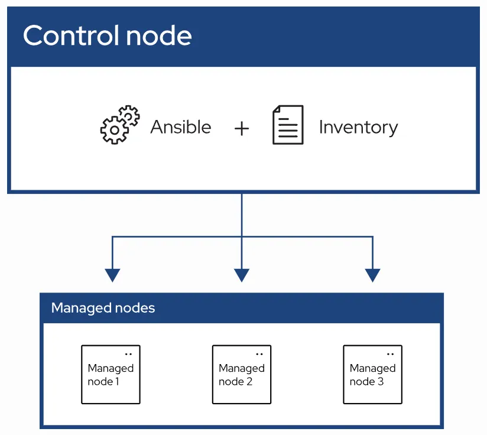

- 대량의 서버 인프라 관리를 자동화하는 IaC 도구
- 컨트롤 노드에서 앤서블 실행 시 스크립트에 작성된 내용에 따라 각 노드에 작업 자동화

## Ansible 구조

ansible.cfg + inventory + playbook

### ansible.cfg

ansible 기본 설정 파일

- inventory 경로 지정
- `remote_user`: 각 서버에 ssh 접근 시 어떤 계정으로 접근할 지 지정
    - inventory에 각 서버마다 접근할 계정 지정할 수도 있지만 단일 계정으로 접근 권장
- `become = true`: 리모트 노드에서 Ansible 동작 시 sudo 권한으로 동작하도록 설정
    - become 설정은 ansible.cfg에서 명시하지 않아도 각 playbook마다 개별 설정 가능
- `host_key_checking = False`: 처음 SSH 접속하는 서버는 fingerprint를 남겨야 하지만 이 옵션으로 무시하고 접속
- `remote_tmp = /tmp/.ansible-{USER}`: Ansible은 명령어 실행 시 임시 파일을 접속 디렉토리에 작성하는데, 접속 서버에서 계정이 디렉토리에 대한 쓰기 권한이 없을때 경로를 임시 파일 작성 경로를 /tmp로 우회

```bash
[defaults]
inventory = /home/ncloud24/ansible/inventory
remote_user = <서버 계정>
host_key_checking = False
remote_tmp = /tmp/.ansible-{USER}

[privilege_escalation]
become = true
```

### inventory

ansible 동작 시 대상 호스트 및 변수를 정의하는 파일

```bash
[prod]
prod1 ansible_host=192.168.0.1 ansible_user=user2
prod2 ansible_host=192.168.0.2 ansible_user=user3
prod3 ansible_host=192.168.0.3

[dev]
dev1 ansible_host=192.168.1.1
dev2 ansible_host=192.168.1.2
dev3 ansible_host=192.168.1.3
dev4 ansible_host=192.168.1.4
dev5 ansible_host=192.168.1.5

[all:vars]
ansible_ssh_private_key_file=/home/rocky/key.pem
```

- 이 설정에서는 각 리모트 노드들의 alias와 ip를 지정해서 동작
    - `ansible_host`는 ansible 내부적으로 ip로 인식하는 예약 변수
    - inventory에서 ansible_host을 명시하지 않는다면 /etc/hosts에서 도메인, IP 작성 ⇒ inventory에 도메인 명시하면 동일하게 동작 가능
    - `ansible_user` 변수로 서버별 접속 계정을 다르게 설정 가능
- 각 그룹마다 변수를 다르게 설정 가능
    - `all:vars`를 사용해서 전체 호스트에 대한 변수 설정
    - `ansible_ssh_private_key_file` 변수로 키 파일 위치 지정 가능

### playbook

어떤 서버, 어떤 명령어를 실행할지 정의하는 yaml 파일

> 모든 서버의 /home/ansible 경로에 0755의 권한을 가진 pkg 디렉토리 생성 yaml
> 

```bash
---
- name: Playbook 테스트
  hosts: all:!prod1

  tasks:
    - name: 디렉토리 생성
      file:
        path: /home/ansible/pkg
        state: directory
        mode: '0755'
```

- host에 inventory에 정의한 alias, group 등등으로 대상 리모트 노드 지정
    - 예시
        - prod ⇒ prod1, prod2, prod3 총 3개 서버 대상
        - prod1 ⇒ 개별 서버 지정 가능
        - all ⇒ inventory에 기록된 모든 서버 대상
        - all:!prod1 ⇒ prod1 서버를 제외한 모든 서버 대상
- task에 어떤 모듈을 어떻게 동작시킬지 정의
    - task에 여러 모듈 실행 가능
    - 한 yaml에서 여러 task도 실행 가능
    - 이 설정에서는 `file` 모듈 실행