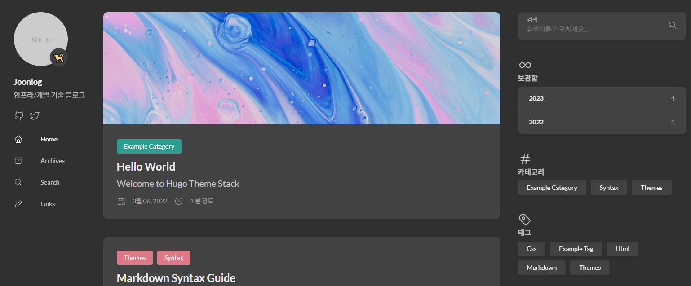

> GitHub Pages로 Hugo 템플릿의 Stack Theme를 사용해서 깃허브 블로그를 구축
> 

> 별도의 컨텐츠 설정 없이 배포까지 정상적인지 확인
> 

## Hugo Stack 구조

- `config`
    - Hugo Stack 설정 폴더
        - 사이트 url, 언어, 페이지네이션, footer/sidebar 파라미터, 메뉴, 모듈 등을 설정
- `content`
    - 포스팅 글, 아카이브, 검색, 링크, 카테고리 등의 페이지가 존재
- `static`
    - 정적 파일들이 있는 폴더
- `assets`
    - 빌드에 포함할 커스텀 css, 이미지를 넣는 폴더
- `.github`
    - GitHub Action 배포에 사용할 deploy.yml이 있는 폴더
- `go.mod`
    - go 모듈

## Hugo Stack 구축

- 깃허브 소스 클론
    
    ```bash
    git clone https://github.com/CaiJimmy/hugo-theme-stack-starter.git
    ```
    
- config 수정
    - `config/_default/config.toml`
        
        ```bash
        baseurl = "https://joonlog.github.io"
        languageCode = "ko-kr"
        title = "Joonlog"
        defaultContentLanguage = "ko"
        hasCJKLanguage = true
        ```
        
- footer, sidebar 수정
    - `config/_default/params.toml`
        
        ```bash
        since = 2024
        emoji = "🐕"
        subtitle = "인프라/개발 기술 블로그"
        ```
        

### 배포 설정

- 배포 설정 수정
    - `master` 브랜치에 푸시될때 자동 배포하는 설정을 `main` 브랜치로 수정
    - `.github/workflows/deploy.yml`
        
        ```bash
        on:
            push:
                branches: [main]
            pull_request:
                branches: [main]
        ```
        
- 배포 방식 변경
    - starter 리포에 있는 기존 deploy.yml은 gh-pages 방식
    - 배포 과정:
        1. `main` 브랜치로 코드 푸시
        2. 빌드
        3. 빌드한 결과물을 `gh-pages` 브랜치에 푸시
        4. GitHub Pages가 `gh-pages` 브랜치에서 블로그 서빙
            - 2개의 브랜치에 거렻서 배포되기 때문에 느림
    - GitHub Actions Artifact 방식으로 변경
    - 배포 과정
        1. `main` 브랜치로 코드 푸시
        2. 빌드
        3. 빌드한 결과물을 artifact에 업로드
        4. GitHub Pages가 artifact에서 직접 서빙
            - GitHub Pages를 사용할 때의 최신 배포 방식
            - gh-pages 브랜치 관리 불필요
            - 빠름
    - `.github/workflows/deploy.yml`
        - `gh-pages` 브랜치에 푸시할 필요가 없어져서 contentes 권한을 write로 유지할 필요가 없어짐
        - GitHub Pages에 직접 배포하기 위한 `pages:write` 권한
        - OIDC 보안을 위한 `id-token:write`
            
            ```bash
                    permissions:
                        contents: read
                        pages: write
                        id-token: write
            ```
            
        - 기존 코드는 gh-pages 브랜치에 푸시하는 코드
        - 대신 artifact에 푸시 + 푸시한 artifact를 GitHub Pages로 배포
            
            ```bash
                        - name: Upload artifact
                          uses: actions/upload-pages-artifact@v3
                          with:
                              path: ./public
            
                        - name: Deploy to GitHub Pages
                          id: deployment
                          uses: actions/deploy-pages@v4
            ```
            

### GitHub Pages 설정

- Repository 생성
    - GitHub에서 `<username>.github.io Repository` 생성
        - 깃허브 블로그로 사용하기 위해선 반드시 위 이름으로 Repository 생성 필요
- GitHub Pages 활성화
    - Settings - Pages - Build and deployment
        - `GitHub Actions` 선택

### 배포 확인

- 소스 푸시
    
    ```bash
    git add .
    git commit -m "First Push"
    git push
    ```
    
- 배포 성공!
    
    
    

### 참고

- Hugo Stack GitHub:
https://github.com/CaiJimmy/hugo-theme-stack
- Hugo Stack Starter GitHub:
https://github.com/CaiJimmy/hugo-theme-stack-starter
- Hugo Theme:
https://themes.gohugo.io/