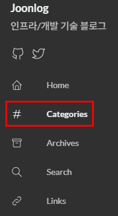
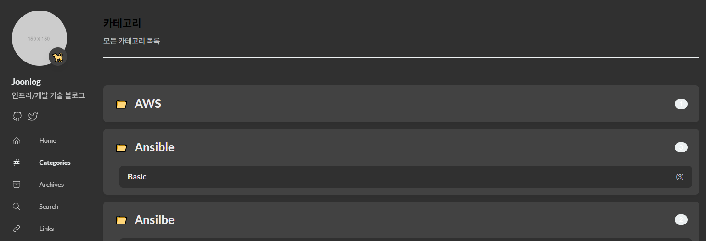
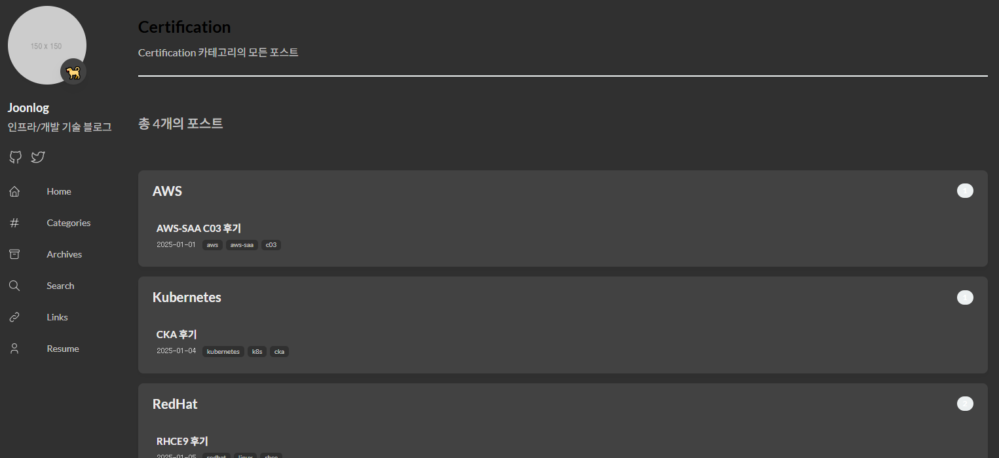
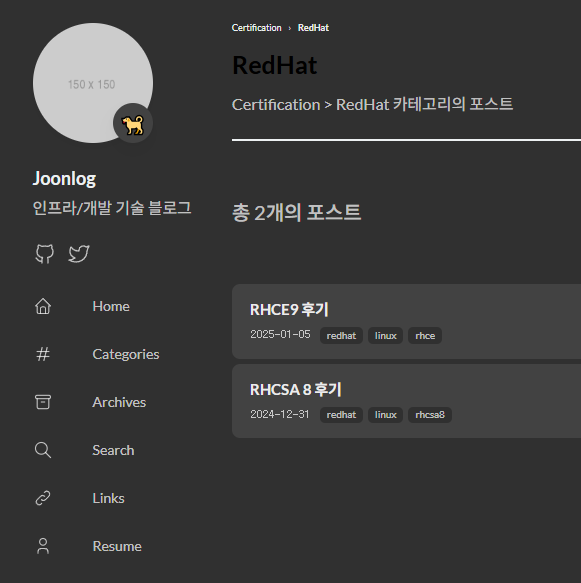

> 기존 Hugo Stack 테마에 계층적 카테고리 시스템을 커스텀
> 

## 개요

### 기존 카테고리

- 기존 카테고리는 정확하게 태그와 동일한 역할을 했었음
    - Hugo Taxonomy가 자동으로 /categories/linux, /categories/middleware 페이지 생성
        - 각 카테고리를 독립적인 태그처럼  평면적으로면 취급함
        - 각 포스트들에 [”Linux”, “Milldeware”]로 설정이 되어있더라도 Linux, Milldeware 두개의 카테고리가 포스팅에 부여되는 식으로만 동작
- 이전 사용하던 Jekyll Chirpy 테마처럼 계층적 카테고리를 구현하고 싶었음

### 커스텀 카테고리

- 메인 카테고리와 서브 카테고리의 2단계 계층 구조
- 자동 카테고리 페이지 생성 코드로 `/categories/`, `/categories/메인/`, `/categories/메인/서브/` 3가지 페이지 생성
    - `/categories`
        - 전체 카테고리 트리 페이지
            - 모든 포스트 스캔 → 메인/서브 카테고리 추출 → 트리 구조로 표시
        - `layouts/categories/list.html`
    - `/categories/메인/`
        - 메인 카테고리 아래의 서브 카테고리 목록 페이지
            - `categories[0] == "메인"`인 서브 카테고리들만 표시
        - `category-primary.html`
    - `/categories/메인/서브/`
        - 메인+서브 카테고리 조건을 만족하는 포스트 목록 페이지
            - `categories[0] == "메인" AND categories[1] == "서브”`인 포스트만 표시
        - `category-secondary.html`

---

## 1. 카테고리 페이지 자동 생성 스크립트

- `scripts/generate-categories.go`
- Hugo 빌드 전에 실행되어야 하는 전처리 스크립트
- GitHub Actions에서 `go run scripts/generate-categories.go` 명령으로 실행

### 코드 구조 및 역할

### 1.1 기본 구조체 정의

- 각 포스트에서 추출한 카테고리 정보를 저장할 구조체
    
    ```go
    package main
    
    import (
        "fmt"
        "os"
        "path/filepath"
        "regexp"
        "strings"
    )
    
    type CategoryInfo struct {
        Primary   string
        Secondary string
    }
    ```
    

### 1.2 main 함수 - 디렉토리 초기화

- `content/categories` 디렉토리를 매번 새로 생성
    - 기존 것 삭제 후 재생성
        - 포스트가 삭제되면 해당 카테고리 페이지도 자동으로 삭제되어야 하기 때문
    
    ```go
    func main() {
        contentDir := "content/post"
        categoriesDir := "content/categories"
    
        os.RemoveAll(categoriesDir)
        os.MkdirAll(categoriesDir, 0755)
    ```
    

### 1.3 포스트 스캔 및 카테고리 수집

- `content/post` 디렉토리의 모든 마크다운 파일 스캔
- 각 파일에서 `categories: ["메인", "서브"]` 형태로 정의된 카테고리 추출
- categoryMap 구조: map[메인]map[서브]bool
    - 예: `{"Linux": {"Middleware": true, "Shell": true}}`
    
    ```go
        categoryMap := make(map[string]map[string]bool)
    
        filepath.Walk(contentDir, func(path string, info os.FileInfo, err error) error {
            if err != nil || info.IsDir() || !strings.HasSuffix(path, ".md") {
                return nil
            }
    
            content, err := os.ReadFile(path)
            if err != nil {
                return nil
            }
    
            cats := extractCategories(string(content))
            if len(cats) >= 2 {
                primary := cats[0]
                secondary := cats[1]
    
                if categoryMap[primary] == nil {
                    categoryMap[primary] = make(map[string]bool)
                }
                categoryMap[primary][secondary] = true
            }
            return nil
        })
    ```
    
- `extractCategories` 함수
    - 정규식으로 front matter에서 `categories: [...]` 부분 찾기
    - 쌍따옴표 제거하고 쉼표로 분리
    - 예: `["Linux", "Middleware"]` → `[]string{"Linux", "Middleware"}`
        
        ```go
        func extractCategories(content string) []string {
            re := regexp.MustCompile(`categories:\\s*\\[([^\\]]+)\\]`)
            matches := re.FindStringSubmatch(content)
            if len(matches) < 2 {
                return nil
            }
        
            categoriesStr := matches[1]
            categoriesStr = strings.ReplaceAll(categoriesStr, `"`, "")
            parts := strings.Split(categoriesStr, ",")
        
            var result []string
            for _, part := range parts {
                trimmed := strings.TrimSpace(part)
                if trimmed != "" {
                    result = append(result, trimmed)
                }
            }
            return result
        }
        ```
        

### 1.4 메인 카테고리 페이지 생성

- 메인 카테고리마다 `content/page/categories/메인/_index.md` 생성
- `layout: "category-primary"` → Hugo가 `layouts/_default/category-primary.html` 템플릿 사용하도록 설정
- `primary_category` 파라미터로 필터링에 사용할 카테고리 이름 전달
    
    ```go
        for primary, secondaries := range categoryMap {
            primaryDir := filepath.Join(categoriesDir, strings.ToLower(primary))
            os.MkdirAll(primaryDir, 0755)
    
            primaryIndexPath := filepath.Join(primaryDir, "_index.md")
            primaryContent := fmt.Sprintf(`---
    title: "%s"
    layout: "category-primary"
    primary_category: "%s"
    ---
    `, primary, primary)
            os.WriteFile(primaryIndexPath, []byte(primaryContent), 0644)
    ```
    

### 1.5 서브 카테고리 페이지 생성

- 서브 카테고리마다 `content/page/categories/메인/서브.md` 생성
- `layout: "category-secondary"` → `layouts/_default/category-secondary.html` 사용하도록 설정
- 두 개의 파라미터로 AND 조건 필터링 가능
    
    ```go
            for secondary := range secondaries {
                secondaryPath := filepath.Join(primaryDir, strings.ToLower(secondary)+".md")
                secondaryContent := fmt.Sprintf(`---
    title: "%s"
    layout: "category-secondary"
    primary_category: "%s"
    secondary_category: "%s"
    ---
    `, secondary, primary, secondary)
                os.WriteFile(secondaryPath, []byte(secondaryContent), 0644)
            }
        }
    ```
    

### 생성 결과 예시

```
content/page/categories/
├── linux/
│   ├── _index.md (primary_category: "Linux")
│   ├── middleware.md (primary: "Linux", secondary: "Middleware")
│   └── shell.md (primary: "Linux", secondary: "Shell")
└── scm/
    ├── _index.md (primary_category: "SCM")
    └── kubernetes.md (primary: "SCM", secondary: "Kubernetes")
```

---

## 2. Categories 페이지 템플릿

- `layouts/categories/list.html`
- Hugo의 템플릿 우선순위: `layouts/categories/list.html` > `themes/.../layouts/categories/list.html`
- `/categories/` URL은 Hugo가 자동으로 categories taxonomy 페이지로 인식
- 이 위치에 파일을 두면 테마의 기본 템플릿을 override

### 템플릿 구조 및 역할

### 2.1 계층 구조 빌드

- 테마의 `baseof.html`에서 `{{ block "main" . }}`를 이 내용으로 대체
- 모든 포스트를 순회하며 계층 구조 빌드
- $hierarchy 구조: `{"Linux": ["Middleware", "Shell"], "SCM": ["Kubernetes"]}`
- `.Site.RegularPages`: Hugo의 모든 일반 페이지
- `.Params.categories`: 각 포스트의 front matter에서 categories 배열
- `index $cats 0`: 배열의 첫 번째 요소 (메인 카테고리)
- `merge`: Go template의 딕셔너리 병합 함수
    
    ```html
    {{ define "main" }}
    
    {{ $hierarchy := dict }}
    
    {{ range .Site.RegularPages }}
        {{ $cats := .Params.categories }}
        {{ if and $cats (ge (len $cats) 2) }}
            {{ $main := index $cats 0 }}
            {{ $sub := index $cats 1 }}
    
            {{ if not (index $hierarchy $main) }}
                {{ $hierarchy = merge $hierarchy (dict $main (slice)) }}
            {{ end }}
    
            {{ $subs := index $hierarchy $main }}
            {{ $subs = $subs | append $sub }}
            {{ $hierarchy = merge $hierarchy (dict $main $subs) }}
        {{ end }}
    {{ end }}
    ```
    

### 2.2 메인 카테고리별 포스트 수 계산

- `uniq`: 중복 제거
    - 같은 서브 카테고리가 여러 포스트에 있을 수 있음
- `$totalPosts`: 해당 메인 카테고리에 속한 전체 포스트 수 계산
    
    ```html
    {{ range $mainCat, $subCats := $hierarchy }}
        {{ $subCats = uniq $subCats | sort }}
    
        {{ $totalPosts := 0 }}
        {{ range $.Site.RegularPages }}
            {{ $cats := .Params.categories }}
            {{ if and $cats (ge (len $cats) 1) }}
                {{ if eq (index $cats 0) $mainCat }}
                    {{ $totalPosts = add $totalPosts 1 }}
                {{ end }}
            {{ end }}
        {{ end }}
    ```
    

### 2.3 토글 UI

- `<details>`: 토글
- `open` 속성: 기본적으로 펼쳐진 상태
- `urlize`: URL 안전 문자열로 변환
    - "Linux Kernel" → "linux-kernel"
- `/categories/linux/` → `scripts/generate-categories.go`가 생성한 `_index.md` 페이지로 이동
    
    ```html
        <details class="category-group" open>
            <summary class="main-cat">
                <span class="main-cat-title">
                    <span class="icon">📁</span>
                    <a href="{{ printf "/categories/%s/" ($mainCat | urlize) }}">{{ $mainCat }}</a>
                </span>
                <span class="post-count-badge">{{ $totalPosts }}</span>
            </summary>
    ```
    

### 2.4 서브 카테고리 목록

- 각 서브 카테고리의 포스트 개수 계산
- AND 조건: `categories[0] == mainCat AND categories[1] == subCat`
- `/categories/linux/middleware/` → `generate-categories.go`가 생성한 `middleware.md` 페이지로 이동
    
    ```html
            <div class="sub-cats">
                {{ range $subCat := $subCats }}
                    {{ $count := 0 }}
                    {{ range $.Site.RegularPages }}
                        {{ $cats := .Params.categories }}
                        {{ if and $cats (ge (len $cats) 2) }}
                            {{ if and (eq (index $cats 0) $mainCat) (eq (index $cats 1) $subCat) }}
                                {{ $count = add $count 1 }}
                            {{ end }}
                        {{ end }}
                    {{ end }}
    
                    <a href="{{ printf "/categories/%s/%s/" ($mainCat | urlize) ($subCat | urlize) }}" class="sub-cat-link">
                        <span class="sub-cat-name">{{ $subCat }}</span>
                        <span class="count">({{ $count }})</span>
                    </a>
                {{ end }}
            </div>
        </details>
    {{ end }}
    
    ```
    

### 2.5 스타일링

- 인라인 CSS: 이 페이지에만 적용되는 스타일
- `var(--accent-color)`: 테마에서 정의한 CSS 변수 사용 (다크 모드 대응)
    
    ```html
    <style>
    .page-header {
        margin-bottom: 2rem;
        padding-bottom: 1rem;
        border-bottom: 2px solid var(--accent-color);
    }
    /* ... 나머지 CSS ... */
    </style>
    {{ end }}
    ```
    

---

## 3. 메인 카테고리 페이지 템플릿

- 파일 위치: `layouts/_default/category-primary.html`
- `generate-categories.go`가 생성한 `_index.md`에서 `layout: "category-primary"` 지정
- Hugo는 `layouts/_default/` 디렉토리에서 커스텀 레이아웃을 찾음
- 파일명이 `category-primary.html`이므로 `layout: "category-primary"`와 매칭

### 템플릿 구조 및 역할

### 3.1 포스트 필터링

- `.Params.primary_category`: `generate-categories.go`가 front matter에 추가한 파라미터
- 필터링 조건: `categories[0] == $primaryCat`
- `$posts`: 필터링된 포스트 목록 (slice)
    
    ```html
    {{ $primaryCat := .Params.primary_category }}
    
    {{ $posts := slice }}
    {{ range .Site.RegularPages }}
        {{ $cats := .Params.categories }}
        {{ if and $cats (ge (len $cats) 1) }}
            {{ if eq (index $cats 0) $primaryCat }}
                {{ $posts = $posts | append . }}
            {{ end }}
        {{ end }}
    {{ end }}
    ```
    

### 3.2 서브 카테고리 추출

- 필터링된 포스트들에서 서브 카테고리 목록 추출
- `in`: Go template의 배열 포함 여부 확인 함수
- 알파벳 순으로 정렬
    
    ```html
    {{ $subCategories := slice }}
    {{ range $posts }}
        {{ $cats := .Params.categories }}
        {{ if ge (len $cats) 2 }}
            {{ $sub := index $cats 1 }}
            {{ if not (in $subCategories $sub) }}
                {{ $subCategories = $subCategories | append $sub }}
            {{ end }}
        {{ end }}
    {{ end }}
    {{ $subCategories = $subCategories | uniq | sort }}
    ```
    

### 3.3 서브 카테고리별 그룹핑

- 서브 카테고리별로 그룹핑하여 표시
- 각 그룹의 포스트 개수 배지로 표시
    
    ```html
    {{ range $subCat := $subCategories }}
        {{ $postCount := 0 }}
        {{ range $posts }}
            {{ $cats := .Params.categories }}
            {{ if and (ge (len $cats) 2) (eq (index $cats 1) $subCat) }}
                {{ $postCount = add $postCount 1 }}
            {{ end }}
        {{ end }}
    
        <details class="sub-category-group" open>
            <summary class="sub-category-title">
                <span class="title-text">{{ $subCat }}</span>
                <span class="post-count-badge">{{ $postCount }}</span>
            </summary>
    ```
    

### 3.4 포스트 목록 렌더링

- 각 서브 카테고리 내의 포스트 목록 표시
- `.RelPermalink`: 포스트의 상대 URL
- `first 3`: 태그가 많을 경우 처음 3개만 표시
- `{{ with }}`: 값이 존재할 때만 실행
    
    ```html
            <div class="post-list">
                {{ range $posts }}
                    {{ $cats := .Params.categories }}
                    {{ if and (ge (len $cats) 2) (eq (index $cats 1) $subCat) }}
                        <article class="post-item">
                            <a href="{{ .RelPermalink }}" class="post-link">
                                <h3 class="post-title">{{ .Title }}</h3>
                                <div class="post-meta">
                                    <time>{{ .Date.Format "2006-01-02" }}</time>
                                    {{ with .Params.tags }}
                                        <span class="tags">
                                            {{ range first 3 . }}
                                                <span class="tag">{{ . }}</span>
                                            {{ end }}
                                        </span>
                                    {{ end }}
                                </div>
                            </a>
                        </article>
                    {{ end }}
                {{ end }}
            </div>
        </details>
    {{ end }}
    ```
    

---

## 4. 서브 카테고리 페이지 템플릿

- `layouts/_default/category-secondary.html`
- `generate-categories.go`가 생성한 `middleware.md`에서 `layout: "category-secondary"` 지정
- `layouts/_default/category-secondary.html`과 매칭

### 템플릿 구조 및 역할

### 4.1 Breadcrumb 네비게이션

- Breadcrumb 네비게이션: `Linux › Middleware`
- 메인 카테고리 클릭 시 메인 카테고리 페이지로 이동
    
    ```html
    <header class="page-header">
        <div class="breadcrumb">
            <a href="{{ printf "/categories/%s/" (.Params.primary_category | urlize) }}">
                {{ .Params.primary_category }}
            </a>
            <span class="separator">›</span>
            <span class="current">{{ .Title }}</span>
        </div>
        <h1>{{ .Title }}</h1>
    </header>
    ```
    

### 4.2 AND 조건 필터링

- AND 조건 필터링: `categories[0] == primary AND categories[1] == secondary`
- 두 파라미터 모두 `generate-categories.go`가 front matter에 추가
    
    ```html
    {{ $primaryCat := .Params.primary_category }}
    {{ $secondaryCat := .Params.secondary_category }}
    
    {{ $posts := slice }}
    {{ range .Site.RegularPages }}
        {{ $cats := .Params.categories }}
        {{ if and $cats (ge (len $cats) 2) }}
            {{ if and (eq (index $cats 0) $primaryCat) (eq (index $cats 1) $secondaryCat) }}
                {{ $posts = $posts | append . }}
            {{ end }}
        {{ end }}
    {{ end }}
    ```
    

### 4.3 포스트 목록

- 필터링된 포스트 목록만 표시
- 서브 카테고리 그룹핑 없이 플랫한 리스트
    
    ```html
    <div class="post-count">
        총 {{ len $posts }}개의 포스트
    </div>
    
    <section class="category-posts">
        <div class="post-list">
            {{ range $posts }}
                <article class="post-item">
                    <a href="{{ .RelPermalink }}" class="post-link">
                        <h3 class="post-title">{{ .Title }}</h3>
                        <div class="post-meta">
                            <time>{{ .Date.Format "2006-01-02" }}</time>
                            {{ with .Params.tags }}
                                <span class="tags">
                                    {{ range first 3 . }}
                                        <span class="tag">{{ . }}</span>
                                    {{ end }}
                                </span>
                            {{ end }}
                        </div>
                    </a>
                </article>
            {{ end }}
        </div>
    </section>
    ```
    

---

## 5. GitHub Actions 워크플로우 수정

- `.github/workflows/deploy.yml`
- 추가한 부분
    1. `generate-categories.go` 실행 → `content/page/categories/` 디렉토리 생성
    2. Hugo 빌드 → 생성된 카테고리 페이지들을 포함하여 정적 사이트 생성
    
    ```yaml
    - name: Generate category pages
      run: go run scripts/generate-categories.go
    
    - name: Build
      run: hugo --minify --gc
    ```
    

---

## 6. 메뉴 설정

- `config/_default/menu.toml`
    - `identifier`: Hugo가 이 메뉴 항목을 식별하는 고유 ID
    - `name`: 사용자에게 표시될 메뉴 이름
    - `url`: 클릭 시 이동할 경로
    - `weight`: 메뉴 정렬 순서 (낮을수록 위에 표시)
    - `icon`: 테마의 `assets/icons/categories.svg` 아이콘 사용
    
    ```toml
    [[main]]
    identifier = "categories"
    name = "Categories"
    url = "/categories/"
    weight = 2
    [main.params]
    icon = "categories"
    ```
    
- Archives weight 조정
    - `content/page/archives/index.md`
    
    ```yaml
    menu:
        main:
            weight: 3  # 기존 2에서 3으로 변경
    ```
    

## 구현 화면

- 메뉴
    
    
    
- /categories 페이지
    
    
    
- /categories/메인 페이지
    
    
    
- /categories/메인/서브 페이지
    
    
