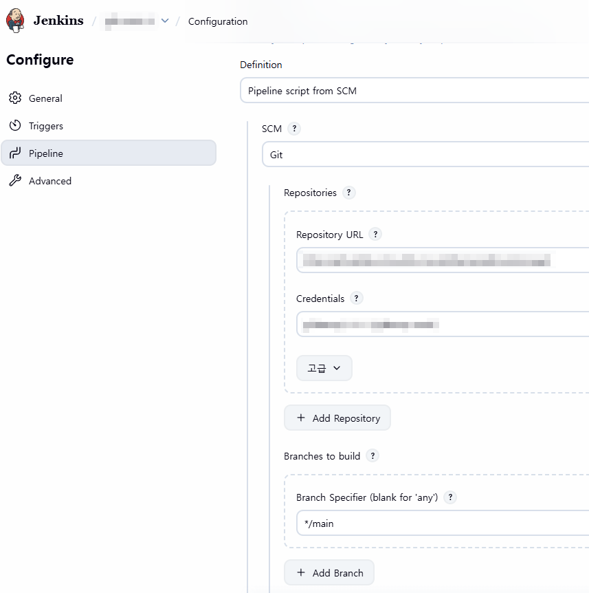

> PHP 애플리케이션에 대한 CI/CD 파이프라인 설정 방법
> 

### 환경

- Git 리포지토리 및 컨테이너 레지스트리: GitLab
- CI/CD: Jenkins
- PHP 버전: 8.3
- 파이프라인을 컨테이너에서 동작시키기 위한 [Jenkins Agent 도커 설정](https://joonlog.github.io/p/jenkins-agent%EB%A5%BC-docker%EB%A1%9C-%EB%8F%99%EC%9E%91%EC%8B%9C%ED%82%A4%EA%B8%B0-%EC%9C%84%ED%95%9C-%EB%B0%A9%EB%B2%95/)

### 파이프라인 설정

- Git 리포지토리 연동
    - Definition: Pipeline script from SCM
        - 파이프라인 구성에 필요한 스크립트를 SCM에서 가져오도록 설정
    - SCM: Git
    - Repository URL: Git 리포지토리 URL
    - Credentials: Git 리포지토리에 접근 가능하도록 저장한 Credential
    - Branch Specifier: */main
        
        
        

## CI 파이프라인

- 컨테이너 이미지를 빌드하기 위한 Dockerfile도 Git 리포지토리에 있어야 함
- PHP는 빌드 과정이 필요 없는 인터프리터 언어이기 때문에 소스 빌드 없이 이미지 빌드 → 이미지 푸시 과정만 필요

### 환경

- agent any로 jenkins agent 컨테이너를 파이프라인으로 사용

```bash
pipeline {
    agent any

    environment {
        APP_NAME             = '<애플리케이션 명>'
        GITLAB_REGISTRY      = '<컨테이너 레지스트리 URL>'
        GITLAB_PROJECT       = '<Git 리포지토리 명>'
        GITLAB_CREDENTIAL_ID = '<저장한 Git PAT 토큰 ID>'
    }
```

### 소스코드 체크아웃

- Git 리포지토리의 최신 커밋을 체크아웃
- 파이프라인 로그에 커밋 정보 출력

```bash
    stages {
        stage('Checkout') {
            steps {
                checkout scm
                sh 'git log -1 --oneline'
            }
        }
```

### 컨테이너 이미지 빌드 및 레지스트리 푸시

- Git 리포지토리에 있는 Dockerfile을 기반으로 이미지 빌드
- Git 커밋 해시와 Jenkins 빌드 번호를 조합해서 태그 생성
- GitLab PAT 토큰으로 로그인 후 푸시

```bash
        stage('Docker Build & Push') {
            steps {
                script {
                    def gitCommit = sh(returnStdout: true, script: 'git rev-parse --short HEAD').trim()
                    def imageTag  = "${env.BUILD_NUMBER}-${gitCommit}"
                    def fullImage = "${GITLAB_REGISTRY}/${GITLAB_PROJECT}/${APP_NAME}"

                    sh """
                        docker build --no-cache -t ${fullImage}:${imageTag} .
                        docker tag ${fullImage}:${imageTag} ${fullImage}:latest
                    """

                    withCredentials([usernamePassword(credentialsId: "${GITLAB_CREDENTIAL_ID}",
                                                      usernameVariable: 'GITLAB_USER',
                                                      passwordVariable: 'GITLAB_TOKEN')]) {
                        sh """
                            echo "\$GITLAB_TOKEN" | docker login ${GITLAB_REGISTRY} -u "\$GITLAB_USER" --password-stdin
                            docker push ${fullImage}:${imageTag}
                            docker push ${fullImage}:latest
                            docker logout ${GITLAB_REGISTRY}
                        """
                    }

                    echo "Docker image pushed: ${fullImage}:${imageTag}"
                    echo "Docker image pushed: ${fullImage}:latest"
                }
            }
        }
    }

    post {
        success { echo "Build #${env.BUILD_NUMBER} succeeded for ${APP_NAME}" }
        failure { echo "Build #${env.BUILD_NUMBER} failed - check console output" }
    }
}
```

## CD 파이프라인

- Jenkins 서버에서 배포할 서버에 SSH로 접근 후 docker compose 파일을 기동하여 컨테이너 레지스트리의 이미지를 가져오는 방식으로 배포
- 배포할 서버가 여러 개일 경우를 고려해서 구성

### 환경

- agent any로 jenkins agent 컨테이너를 파이프라인으로 사용
- DB 접속정보 등 민감한 정보가 있는 .env 파일은 Jenkins Credential로 관리

```bash
pipeline {
    agent any

    parameters {
        string(name: 'IMAGE_TAG', defaultValue: 'latest', description: 'Docker image tag to deploy')
        choice(name: 'DEPLOY_TARGET', choices: ['WAS1', 'ALL'], description: 'WAS1: <WAS 서버 IP> | ALL: 전체 WAS 배포')
    }

    environment {
        WAS1_HOST = '<WAS1 서버 IP>'
        // WAS2_HOST = '<WAS2 서버 IP>'  // TODO: WAS2 추가 시 활성화
        DEPLOY_PATH = '<배포 경로>'
        GITLAB_REGISTRY = '<컨테이너 레지스트리 URL>'
        GITLAB_PROJECT = '<Git 리포지토리명>'
        IMAGE_NAME = '<컨테이너 이미지 명>'
        DEPLOY_CREDENTIAL_ID = '<배포 서버 SSH 계정명>'
        GITLAB_CREDENTIAL_ID = '<저장한 Git PAT 토큰 ID>'
        // .env 전체를 담은 Secret file ID
        TEACHER_ENV_FILE_CREDENTIAL_ID = 'hlle-prod-env'
    }
```

### 준비

- `배포할 이미지 태그` / `배포 대상 서버`를 선택할 수 있게 설정
- deployHosts: 배포 대상 호스트 목록

```bash
    stages {
        stage('Prepare') {
            steps {
                script {
                    echo "Deploying image: ${GITLAB_REGISTRY}/${GITLAB_PROJECT}/${IMAGE_NAME}:${params.IMAGE_TAG}"
                    echo "Deploy target: ${params.DEPLOY_TARGET}"

                    def deployHosts = []
                    if (params.DEPLOY_TARGET == 'WAS1') {
                        deployHosts = [WAS1_HOST]
                    } else if (params.DEPLOY_TARGET == 'ALL') {
                        deployHosts = [WAS1_HOST]
                        // TODO: WAS2 추가 시 -> deployHosts = [WAS1_HOST, WAS2_HOST]
                    }

                    env.DEPLOY_HOSTS = deployHosts.join(',')
                    echo "Target servers: ${env.DEPLOY_HOSTS}"
                }
            }
        }
```

### 배포

- 컨테이너 레지스트리에서 이미지 풀링
- .env 파일을 Credential에서 배포 서버로 복사
- 배포 경로에서 docker compose 명령어를 통한 애플리케이션 재기동

```bash
        stage('Deploy') {
            steps {
                script {
                    def hosts = env.DEPLOY_HOSTS.split(',')

                    withCredentials([
                        usernamePassword(credentialsId: "${DEPLOY_CREDENTIAL_ID}",
                                         usernameVariable: 'DEPLOY_USER',
                                         passwordVariable: 'DEPLOY_PASS'),
                        usernamePassword(credentialsId: "${GITLAB_CREDENTIAL_ID}",
                                         usernameVariable: 'GITLAB_USER',
                                         passwordVariable: 'GITLAB_TOKEN'),
                        // .env 전체를 파일로 받음
                        file(credentialsId: "${TEACHER_ENV_FILE_CREDENTIAL_ID}",
                             variable: 'HLLE_ENV_FILE')
                    ]) {
                        for (host in hosts) {
                            echo "Deploying to ${host}..."

                            sh """
                                # 1) .env 파일을 대상 서버로 복사
                                sshpass -p "\$DEPLOY_PASS" scp -o StrictHostKeyChecking=no "\$HLLE_ENV_FILE" "\$DEPLOY_USER"@${host}:/tmp/teacher.env

                                # 2) sudo 로 /home/gill/hlle/.env 위치로 이동 + 소유권 nginx로 맞추기
                                sshpass -p "\$DEPLOY_PASS" ssh -o StrictHostKeyChecking=no "\$DEPLOY_USER"@${host} "
                                    sudo mv /tmp/teacher.env ${DEPLOY_PATH}/.env
                                    sudo chown nginx:nginx ${DEPLOY_PATH}/.env

                                    echo 'Logging in to GitLab Registry...'
                                    echo '\$GITLAB_TOKEN' | sudo docker login ${GITLAB_REGISTRY} -u '\$GITLAB_USER' --password-stdin

                                    echo 'Pulling image: ${GITLAB_REGISTRY}/${GITLAB_PROJECT}/${IMAGE_NAME}:${params.IMAGE_TAG}'
                                    sudo docker pull ${GITLAB_REGISTRY}/${GITLAB_PROJECT}/${IMAGE_NAME}:${params.IMAGE_TAG}

                                    echo 'Redeploying containers...'
                                    export IMAGE_TAG=${params.IMAGE_TAG}
                                    sudo docker compose -f ${DEPLOY_PATH}/docker-compose.yaml down
                                    sudo docker compose -f ${DEPLOY_PATH}/docker-compose.yaml up -d

                                    echo 'Checking deployment status...'
                                    sudo docker compose ps

                                    sudo docker logout ${GITLAB_REGISTRY}
                                "
                            """

                            echo "Deployment to ${host} completed."
                        }
                    }
                }
            }
        }
```

### 헬스 체크

- 배포 완료 후 컨테이너 상태 점검

```bash
        stage('Health Check') {
            steps {
                script {
                    echo "Waiting for application to start..."
                    sleep 10

                    def hosts = env.DEPLOY_HOSTS.split(',')

                    withCredentials([usernamePassword(credentialsId: "${DEPLOY_CREDENTIAL_ID}",
                                                      usernameVariable: 'DEPLOY_USER',
                                                      passwordVariable: 'DEPLOY_PASS')]) {
                        for (host in hosts) {
                            echo "Health checking ${host}..."

                            sh """
                                sshpass -p "\$DEPLOY_PASS" ssh -o StrictHostKeyChecking=no \$DEPLOY_USER@${host} "
                                    # 컨테이너 상태 확인
                                    sudo docker ps | grep works

                                    # 헬스체크 (옵션)
                                    # curl -f http://localhost:8080/health || exit 1
                                "
                            """

                            echo "${host} health check passed."
                        }
                    }
                }
            }
        }
    }
}
```