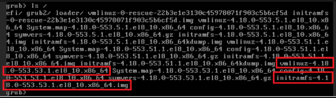

- TroubleShooting - XEN 기반 Rocky Linux 8 업데이트 후 부팅 이슈
    
    > NCP의 Xen 기반 Rocky 8 서버에서 커널 관련 업데이트 후 부팅이 되지 않을 때의 해결 방법
    > 
    
    ### 환경
    
    - CSP: NCP
    - 하이퍼바이저: Xen
    - OS: Rocky 8.10
    
    ### 문제 상황
    
    - 서버에 3rd 파티 솔루션 설치가 필요했던 상황
    - 솔루션 설치 간 다량의 패키지 확인 및 설치가 필요한데, 이 과정 중 grub 업데이트가 포함되어 있었음
    - 패키지 설치 후 재부팅 시 부팅이 되지 않음
    - NCP 콘솔에서 원격 접속 시 grub으로 빠지는 것을 확인
    
    ### 해결 방법
    
    1. NCP 콘솔에서 서버 연격 접속 클릭
    2. 파일 시스템 정상 확인
        - `ls`로 grub이 인식하는 디스크 파티션 확인
        - `ls (hd0,msdos1)/` 같은 명령으로 OS 파일(커널, initramfs 등)이 실제로 존재하는지 확인
    3. 부팅할 파일 확인
        - `/boot` 디렉터리에 있는 커널(`vmlinuz-*`)과 initramfs(`initramfs-*`) 파일이 있는지 확인
        - ex) `vmlinuz-4.18`, `initramfs-4.18`
            
            
            
    4. Grub 명령어로 부팅
        - 커널을 직접 로드하고 강제 부팅
        
        ```bash
        grub> set root=(hd0,msdos1)
        grub> linux /vmlinuz-4.18.0-553.53.1.el8_10.x86_64 root=/dev/xvda2 ro
        grub> initrd /initramfs-4.18.0-553.53.1.el8_10.x86_64.img
        grub> boot
        ```
        
    5. 정상 부팅 확인 후 Grub 파일 재설치
        
        ```bash
        grub2-install /dev/xvda
        ```
        
    6. NCP 콘솔에서 서버 강제 정지 후 시작
        - NCP 콘솔에서 서버가 운영중 상태로 표시되면 성공
            - 이 방법으로 부팅 되지 않으면 스냅샷 생성 및 데이터 이동을 통한 복구 필요
    
    ### 참고
    
    NCP 가이드: 
    https://guide.ncloud-docs.com/docs/xen-rocky8-grub-boot-issue