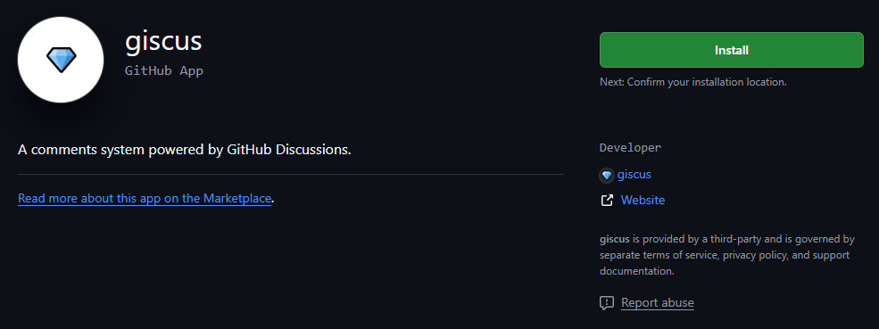
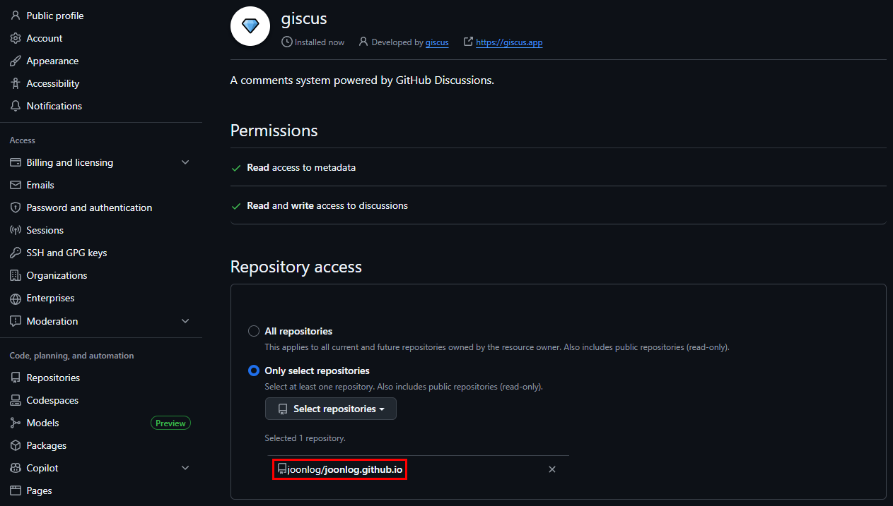
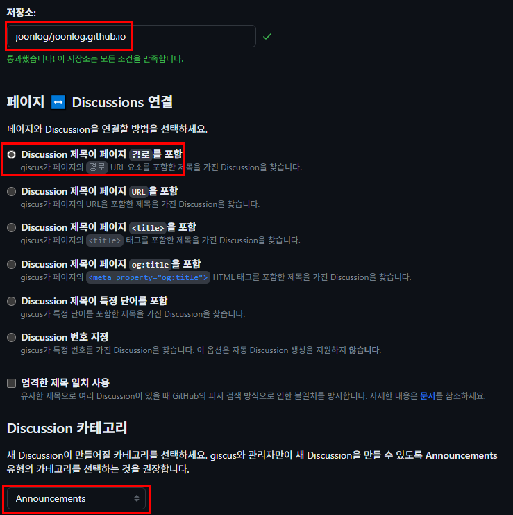
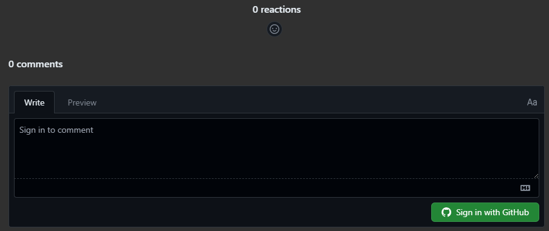

## 1. GitHub Discussions 활성화

1. GitHub Blog Repository 접속
2. Settings 탭 클릭
3. General 섹션에서 Features 찾기
4. Discussions 체크박스 활성화
    
    
    

## 2. Giscus 앱 설치

1. https://github.com/apps/giscus 접속
2. Install 클릭
    
    
    
3. joonlog/joonlog.github.io 저장소 선택
    
    
    

## 3. Giscus 설정값 생성

1. https://giscus.app/ko 접속
2. 다음 정보 입력:
    - 저장소: joonlog/joonlog.github.io
    - 페이지 ↔ Discussions 연결: 경로
    - Discussion 카테고리: Announcements 또는 General 선택
        
        
        
3. giscus 사용에서 출력된 값을 확인
- data-repo
- data-repo-id
- data-category
- data-category-id

## 4. Hugo 설정 파일 수정

- `config/_default/params.toml` 파일 수정
    
    ```bash
    [comments]
    enabled = true
    provider = "giscus"  # disqus에서 giscus로 변경
    
    [comments.giscus]
    repo = "joonlog/joonlog.github.io"
    repoID = "<repo_id>"
    category = "<category_이름>"
    categoryID = "<category_id>"
    mapping = "pathname"
    lightTheme = "light"
    darkTheme = "dark"
    reactionsEnabled = 1
    emitMetadata = 0
    ```
    

## 5. Git 커밋 후 재배포

- 추가 성공!
    
    