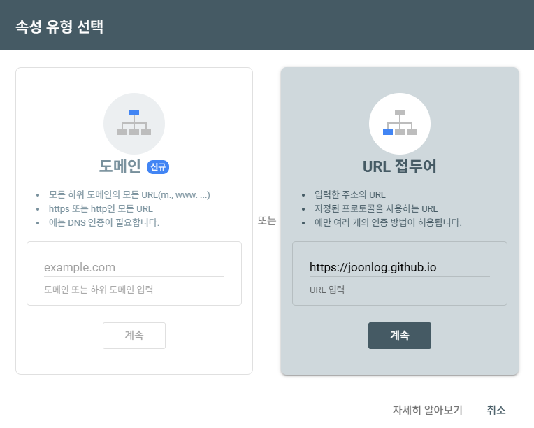

### SEO

SEO는 Search Engine Optimization, 즉 검색 엔진 최적화로 구글이나 네이버 같은 검색 엔진에서 내 블로그가 더 잘 노출되도록 하는 작업이다.

블로그를 운영하더라도, 검색에 노출되지 않으면 방문자가 내 블로그 도메인을 직접 입력해야만 접근 가능하다. 사실상 필수 설정.

### GitHub Pages + Hugo 환경 SEO 설정

1. Sitemap 자동 생성
    - Hugo는 별도 플러그인 없이 sitemap.xml 파일을 자동으로 생성
    - 블로그 글 전체를 포함한 sitemap이 빌드 시 자동 생성됨
    - 배포 후 `https://<블로그주소>/sitemap.xml` 로 접근 가능하면 성공
2. robots.txt 생성
    - 검색 엔진 크롤러에게 사이트 크롤링 규칙을 알려주는 파일
    - `static/robots.txt` 파일 생성
    
    ```
    User-agent: *
    Allow: /
    
    Sitemap: https://<블로그주소>/sitemap.xml
    ```
    
3. Google Search Console 등록
    - Google Search Console 접속
    - `URL 접두어` 방식 선택 → `https://<블로그주소>` 입력
        
        
        
    - HTML 파일 다운로드 후 `static/` 폴더에 저장
        
        ```bash
        static/
        └── <verifications값>.html
        ```
        
    - 배포 후 Google Search Console 내 소유권 확인
        
        
        
    - 생성된 사이트맵 Google Search Console에 등록
    - 등록 후에 즉시 활성화가 되는 것은 아님
        - 하루 정도 대기 필요
            
            