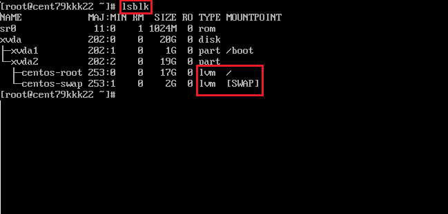
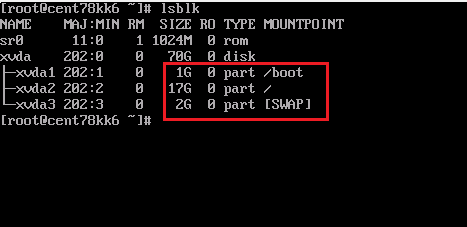

> KT Cloud에서의 루트 디스크 증설 방법
> 

### KT Cloud 루트 디스크 증설 정책

root 디스크:

- linux: 20GB
    - 50GB, 80GB, 100GB로만 증설 가능
        - 증설 이후 감설 불가능
    - 사용 중이던 서버라면 Resize 수행 전 VM 스냅샷, 이미지 필요
- windows 50GB

## 루트 디스크 증설 방법

루트 디스크 증설 위해 추가 작업 필요

- https://manual.cloud.kt.com/kt/compute-server-disk
- 서버 정지 후 디스크 사이즈 변경 필요

### LVM 환경경에서의 루트 디스크 증설



```bash
lsblk
fdisk -l
# 파티션 삭제 및 생성 및 LVM으로 코드 변경
fdisk /dev/xvda
  p d 2
  n p 2 p
  t 2 8e
  w
lsblk
pvresize /dev/xvda2
lvdisplay
lvreize -l +20480 /dev/centos/root
lvdisplay
xfs_growfs(resize2fs) /dev/mapper/centos-root
df -TH
```

### NON-LVM 환경경에서의 루트 디스크 증설



```bash
lsblk
fdisk -l
fdisk /dev/xvda
  p d 3 d 2 p
# 파티션 생성
fdisk /dev/xvda
  n p 2 +97G n p 3 p w
# swap 설정
fdisk /dev/xvda
  t 3 82 p w
재기동
  
resize2fs /dev/xvda2
lsblk
mkswap /dev/xvda3
swapon /dev/xvda3
# UUID 추가
echo "UUID=<UUID> swap swap defaults 0 0" >> /etc/fstab
```