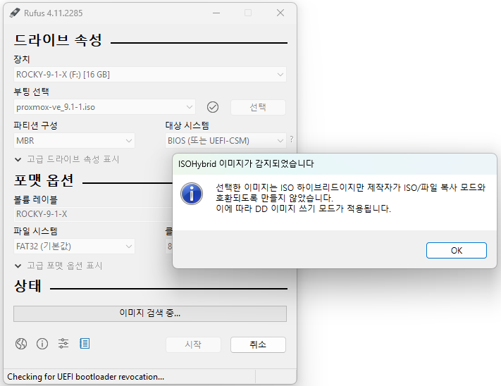
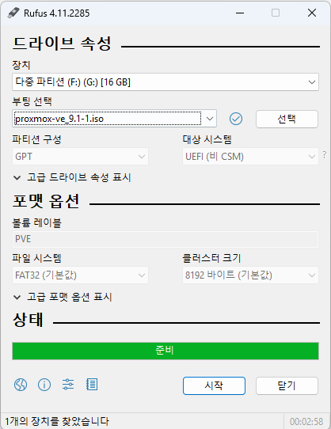
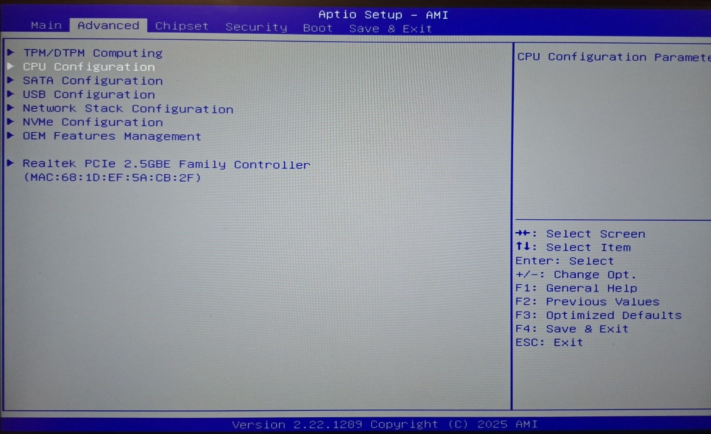
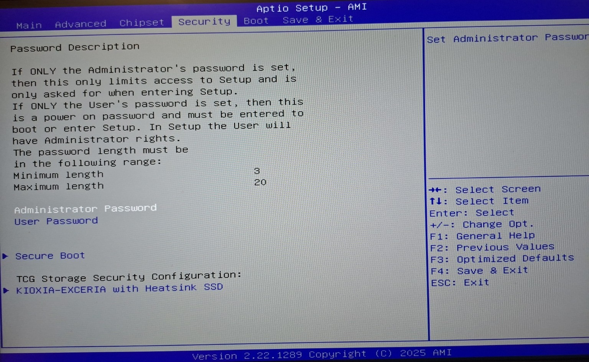
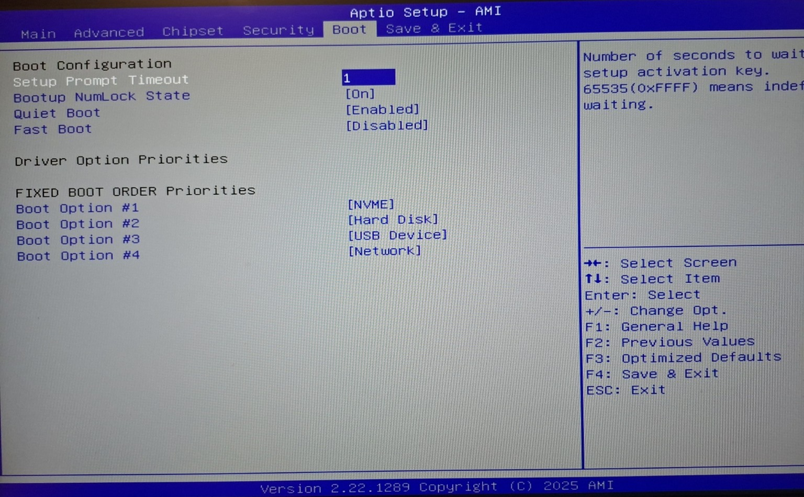
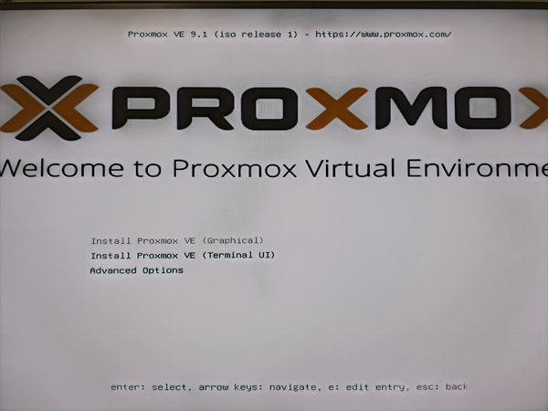
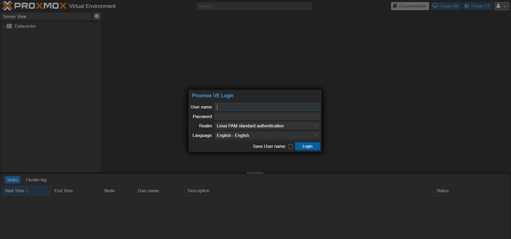

> 개발/인프라/K8S 연습용 홈서버로 Mini PC 구매
> 
> 
> Mini PC에 Proxmox 설치
> 
> - Mini PC 모델: Chatreey AN3P

### 1. Promox 이미지 준비

- ISO 이미지로 설치 가능한 USB를 만들 때 사용
    - https://rufus.ie/ko/
        
        
        
        
        

### 2. Mini PC 부팅

- 미니 PC 부팅하니 바이오스 화면 진입
- 가상화 기능을 써야 하니 관련 설정이 정상적인지 확인
    - Advanced → CPU Configuration → `SVM` / `Virtualization` / `AMD-V` 관련 항목은 무조건 `Enabled`

- USB를 통한 Promox 설치 시 막힐 수 있어서 Secure Boot 해제
    - Boot → Boot Configuration → Secure Boot → `Disabled`

- Boot → Boot Option 순서에서 Promox 설치 USB를 첫번째 순서로 조정

- 설정 저장 및 재기동

### 3. Promox 설정

- 부팅 후 Promox 기본 설정대로 설치 진행
- 인터페이스는 일단 DHCP로 설정
- 모든 설정 후 재부팅하면 설치 완료
    
    
    

### 4. Promox PVE 접근 확인

- 재부팅하면 Promox CLI로 부팅됨
    - ID는 root, PWD는 설정한 비밀번호로 로그인
- CLI에 출력되는 공인IP:Port로 외부에서 PVE(Promox 관리 콘솔) 접근 가능
    - PVE 콘솔 접근 정보는 계정 접근 정보와 동일
- 접근 성공!

