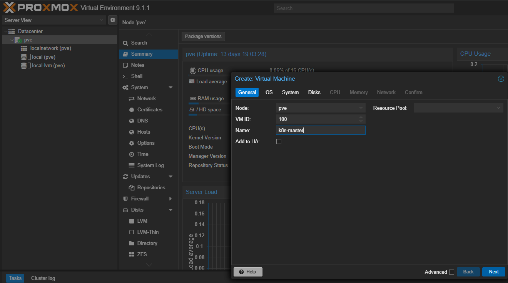
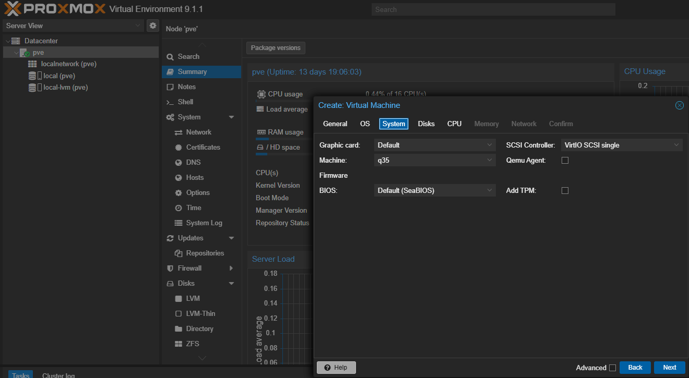
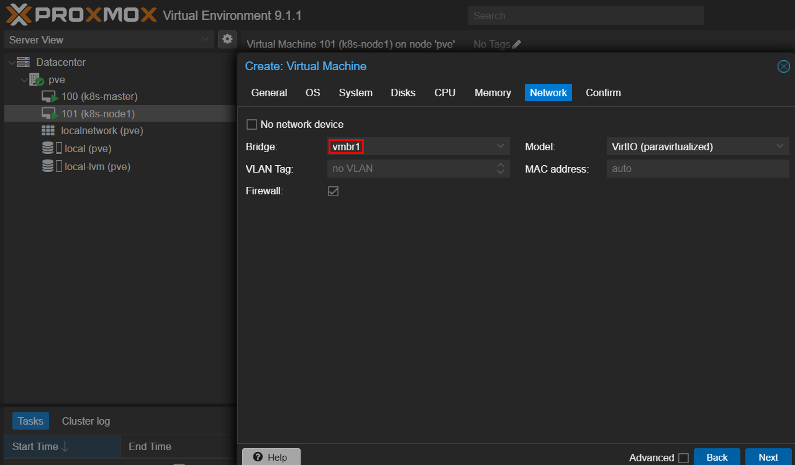
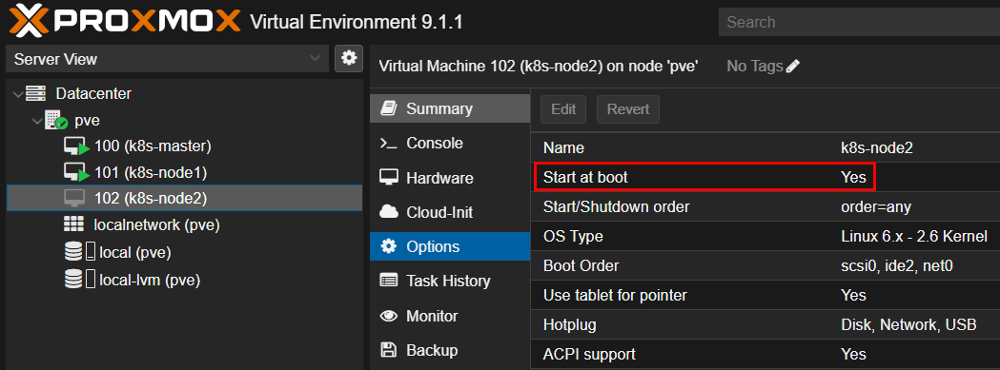

> Promox 내부 VM을 위한 사설 네트워크 인터페이스 생성 필요
> 

### Promox 네트워크 설정

현재 랜선이 그대로 미니 PC에 연결되어 있어 pve의 네트워크 인터페이스는 공인 IP만 존재한다

따라서 Promox 내부 VM을 사설 IP로 관리하기 위한 네트워크 인터페이스가 필요하다

- NI 생성
    
    ```jsx
    vim /etc/network/interfaces
    ```
    
- `auto`: 부팅 시 NI 활성
- `address`: 고정 IP 설정
    - 이 IP가 하위 VM들의 Gateway 역할
- `post-up`: 인터넷 연결
    - 내부 VM에서 외부 네트워크로의 라우팅 허용
    - 출발지가 192.168.100.0/24 대역인 트래픽이 vmbr0으로 나갈 때 vmbr0 IP로 출발지 IP를 SNAT
- `post-down`: 트래픽이 vmbr1으로 내려갈때는 위 NAT 규칙 삭제
    
    ```jsx
    auto vmbr1
    iface vmbr1 inet static
        address 192.168.100.1/24
        bridge_ports none
        bridge_stp off
        bridge_fd 0
    
        post-up   echo 1 > /proc/sys/net/ipv4/ip_forward
        post-up   iptables -t nat -A POSTROUTING -s 192.168.100.0/24 -o vmbr0 -j MASQUERADE
        post-down iptables -t nat -D POSTROUTING -s 192.168.100.0/24 -o vmbr0 -j MASQUERADE
    ```
    
- 신규 생성한 NI 기동
    
    ```jsx
    systemctl restart networking
    ifup vmbr1
    ```
    
- VM에서 인터넷 통신 필요 시 pve에서 nftables 활성화 필수
    - 기본 설정에선 vmbr1에서 vmbr0으로의 FORWARD를 막고 있음
    
    ![PromoxNetworkVMSettings01.png]
    

### Promox에서 VM 생성

- rocky 8.10 이미지 다운로드
    
    ```bash
    cd /var/lib/vz/template/iso/
    wget https://download.rockylinux.org/pub/rocky/8.10/isos/x86_64/Rocky-8.10-x86_64-minimal.iso
    ```
    
- VM 생성
    - 좌측 pve 우클릭 - Create VM
    
    
    
- q35 설정
    
    
    
- Bridge에서 위에서 만든 NI 할당
    
    
    

### Promox VM 설정

- Start at boot를 활성화 해야지 promox 부팅될 때 해당 VM도 부팅
    
    
    
- VM NI 설정
    - 사설 IP 수동 할당 및 게이트웨이, dns 설정
    
    ```jsx
    nmcli con mod enp6s18 ipv4.method manual ipv4.addresses 192.168.100.11/24 ipv4.gateway 192.168.100.1 ipv4.dns 8.8.8.8
    nmcli con mod enp6s18 connection.autoconnect yes
    nmcli con down enp6s18
    nmcli con up enp6s18
    ```
    
- ping 8.8.8.8 성공 시 설정 완료