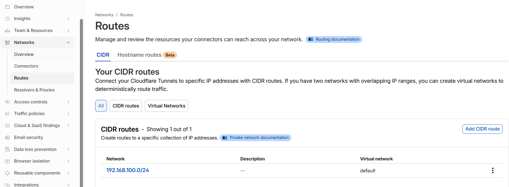
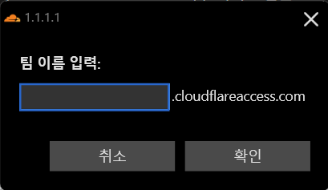
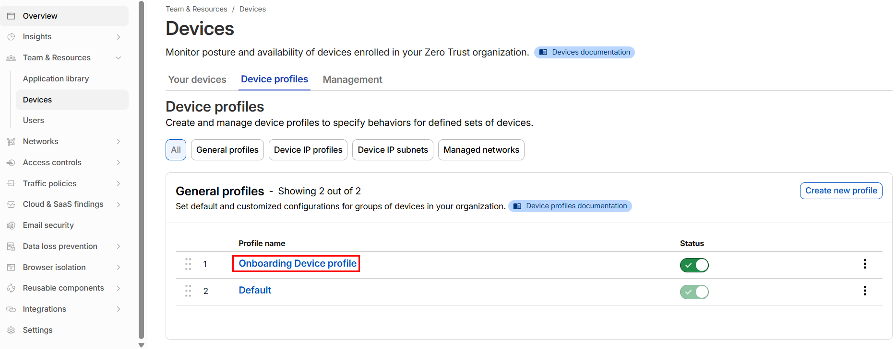
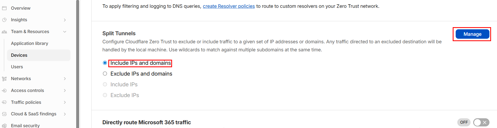

> Cloudflare용 UDP VPN
> 

Cloudflare WARP를 사용하면 Tunnel 내부 네트워크로 직접 접근이 가능하다.

다만 WARP는 UDP 통신이기 때문에 연결이 간헐적으로 끊어질 수 있다.

### 사전 준비

- Cloudflare Tunnel 활성화

### Cloudflare WARP

- Cloudflare에서 제공하는 클라이언트 기반 WireGuard VPN 에이전트
- 디바이스에서 발생하는 트래픽을 Cloudflare 네트워크로 전달하여 보안 정책을 적용하거나 내부 네트워크에 접근할 수 있게 한다

```
클라이언트
→ WARP Client
→ Cloudflare Edge
→ 인터넷
```

일반적인 WARP는 이렇지만, Zero Trust WARP 환경에서는 다음과 같이 동작한다.

```
클라이언트
→ WARP Client
→ Cloudflare Edge
→ Cloudflare Zero Trust 정책(보안 인증)
→ Cloudflare Tunnel
→ Private Network
```

따라서 Cloudflare Tunnel을 뚫어서 Zero Trust를 사전에 구성한 경우에는 WARP로 Tunnel 내부망에 접근이 가능하다.

## 1. Private Network Route 등록

- WARP가 접근할 내부망 CIDR을 등록
    
    ```
    Zero Trust
    → Networks
    → Routes
    → Add route
    ```
    
- 설정
    
    
    
    - 이 설정을 통해 Cloudflare는 다음 경로를 인식
        
        ```
        WARP Client
        → Cloudflare Edge
        → Tunnel Connector
        → 192.168.100.0/24
        ```
        

---

## 2. WARP 클라이언트 설치

WARP 클라이언트를 설치하고 Zero Trust에 연결되면 자동으로 device가 등록된다.

- Zero Trust WARP 접근 시
    
    
    
    - 팀 이름 입력 후 사전 설정했던 인증 절차에 따라 연결 완료
- 확인 경로
    
    ```
    Zero Trust
    → Team & Resources
    → Devices
    ```
    

---

## 3. Device Profile 설정

- WARP 트래픽 정책은 **Device profile**에서 관리된다.
    
    
    
- Split Tunnels 설정
    - 현재 목적이 외부 장치에서 홈서버인 PVE 하위에 있는 노드로의 직접 접근이기 때문에, `192.168.100.x/24`로의 라우팅만 설정
    - `Include IPs and domains`
        
        
        
        - Manage
            - Type: `Address`
            - Value: `192.168.100.0/24`
                - 해당 대역으로의 트래픽 전송 시에만 WARP를 사용하도록 설정

---

## 5. 정상 동작 확인

- 설정 적용 후 WARP 클라이언트를 설치한 장치에서 확인
    - cmd에서: `route print`
    - 정상이라면 다음 경로가 생성
        
        ```
        인터페이스 목록
        Cloudflare WARP Interface
        
        IPv4 테이블
        192.168.100.0    255.255.255.0    
        ```
        
- 이후 내부 노드 통신 가능

---

## 정리

Cloudflare Tunnel만으로는 내부망 접근이 되지 않는다.

WARP를 사용하려면 다음 설정이 필요하다.

```
1. Private Network Route 등록
2. WARP Device 등록
3. Device Profile 정책 적용
4. Split Tunnel에 내부망 CIDR 추가
```

특히 Split Tunnel 설정이 맞지 않으면 WARP routing이 정상 동작하지 않으므로 반드시 확인해야 한다.