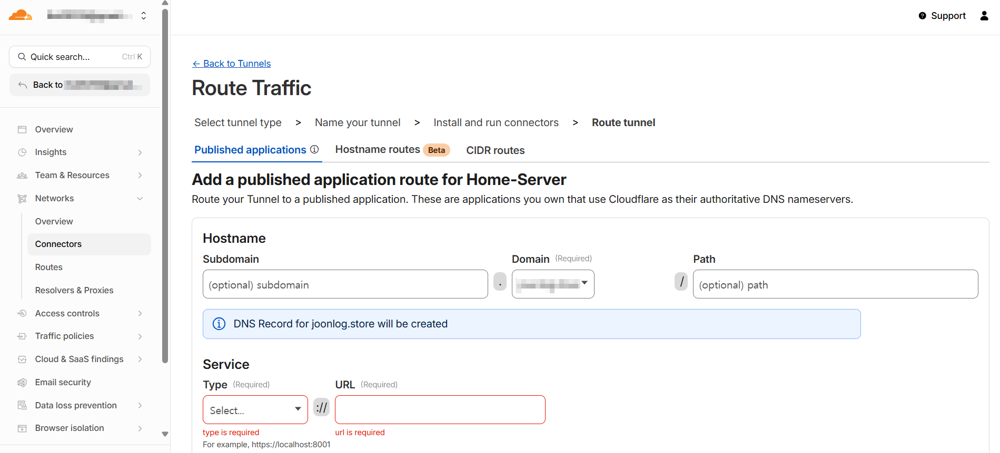
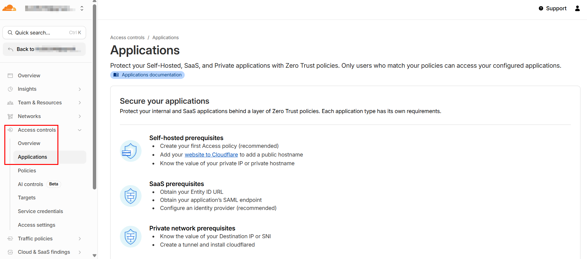
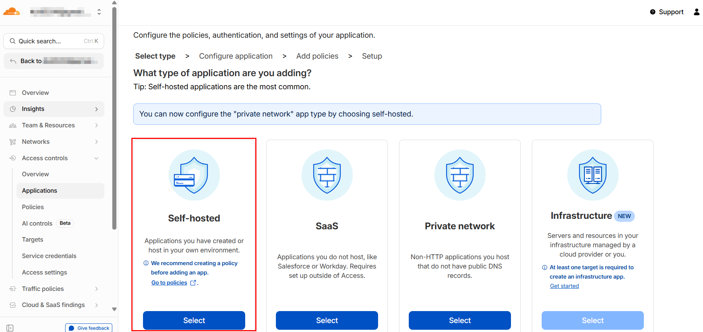
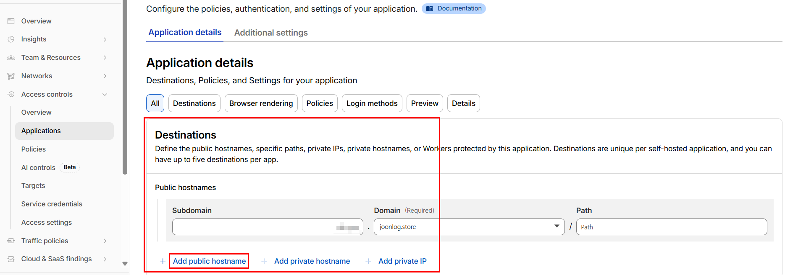
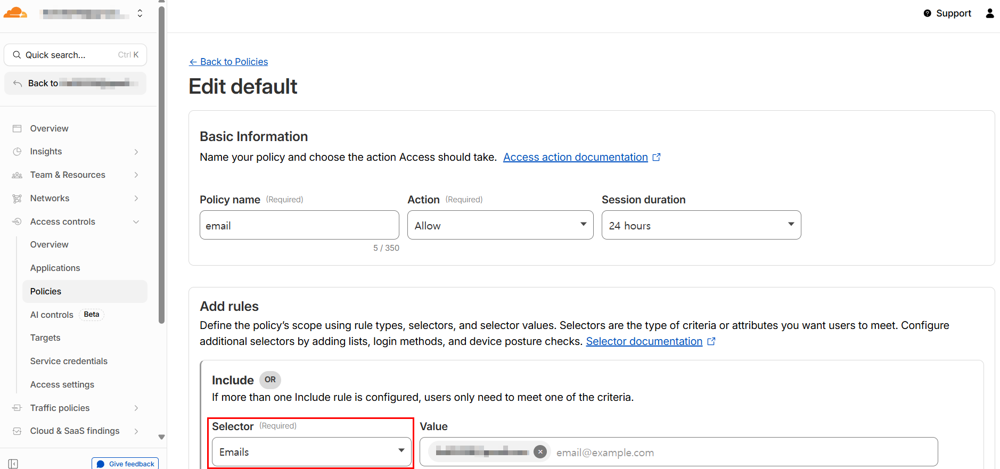
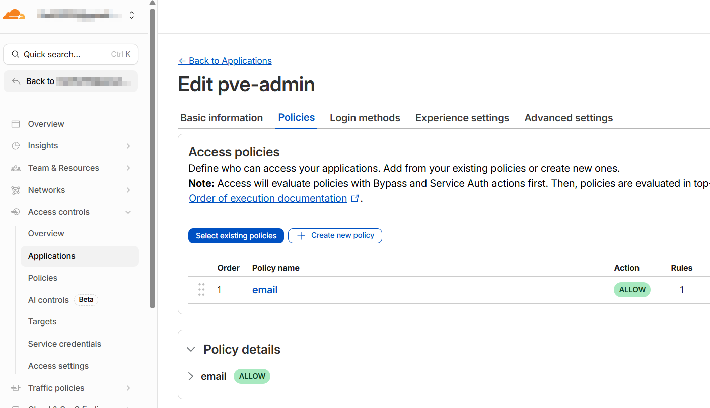
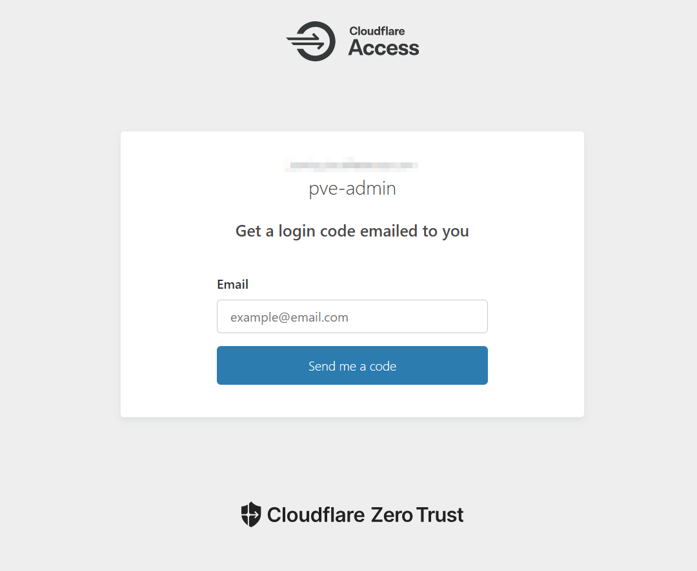

> Cloudflare Tunnel을 사용해 SSH 접근하기 위한 설정
> 

Cloudflare WARP를 사용해도 서버에 통신 가능하긴 하지만, 목적이 SSH라면 WARP는 좋은 방안이 되지 못한다.

WARP는 UDP 기반 VPN 서비스이기 때문에 통신이 계속 끊어지기 때문

SSH용 Routing + cloudflared를 사용해서 서버에 접속한다.

## 0. 사전준비

- Cloudflare Connectors 설정
    - [https://joonlog.github.io/p/cloudflare-tunnel을-사용한-홈서버-promox-pve-콘솔-접근-설정/#1-cloudflared-설치-및-연동](https://joonlog.github.io/p/cloudflare-tunnel%EC%9D%84-%EC%82%AC%EC%9A%A9%ED%95%9C-%ED%99%88%EC%84%9C%EB%B2%84-promox-pve-%EC%BD%98%EC%86%94-%EC%A0%91%EA%B7%BC-%EC%84%A4%EC%A0%95/#1-cloudflared-%EC%84%A4%EC%B9%98-%EB%B0%8F-%EC%97%B0%EB%8F%99)

## 1. Cloudflared Routes 설정

- 연동한 tunnel을 통해서 연결할 도메인 경로 및 라우팅 경로 설정
    - Hostname: 보유 도메인 기입
    - Type: SSH
    - URL: localhost:22
    
    
    
- 여기까지 설정 완료 시 기입한 서브도메인으로 SSH 접근 가능

### 2. Cloudflare Access 설정

- 서브도메인에 대한 인증 설정





- Routes에 설정한 도메인 입력



- Self-hosted 설명에 나와 있듯이 Policy 생성
    
    
    
    - PVE 접속 도메인 접근 시 Email 인증하도록 Policy 설정



- 설정한 Policy 할당

## 3. Cloudflared 설치

- windows
    
    ```jsx
    winget install Cloudflare.cloudflared
    ```
    
- Rocky 8.10
    
    ```jsx
    dnf install -y cloudflared
    ```
    

## 4. SSH 접근

1. Cloudflared 로그인
    
    ```jsx
    cloudflared access login <SSH 접근 도메인>
    ```
    
    
    
    - 이메일 인증 요구하는 화면 출력됨
2. SSH 접근
    - 이메일 인증 완료 후 SSH 접근
    
    ```jsx
    cloudflared access ssh --hostname <SSH 접근 도메인>
    ```
    
    - 접근 성공!
3. SSH alias
    - ssh 명령어로 접근하기 위한 alias
    - Windows
        - C:\Users\`<계정명>`\.ssh\config
    - Linux
        - ~/.ssh/config
    
    ```jsx
    Host pve
      HostName <SSH 접근 도메인>
      User root
      ProxyCommand cloudflared access ssh --hostname %h
    ```
    
    - 접근 성공!