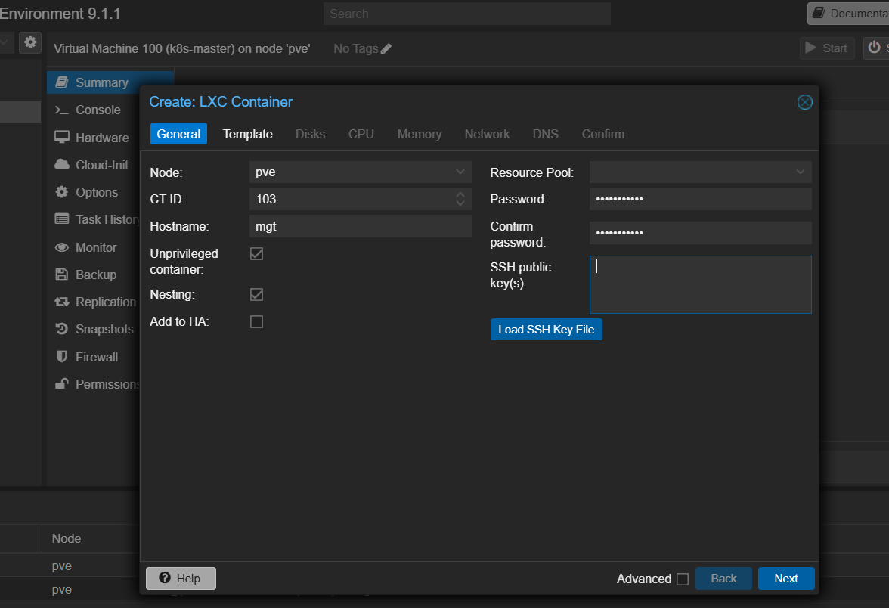
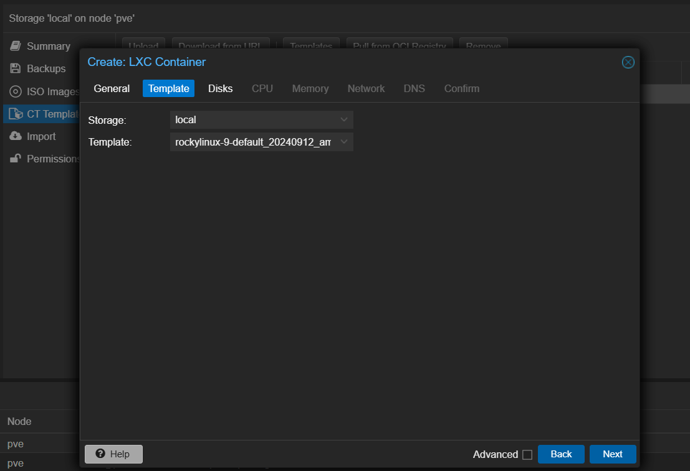

> 홈서버 작업 공간 분리를 위한 관리용 LXC 구성
>
> PVE는 하이퍼바이저만, 작업은 mgt LXC에서

## 0. 관리용 LXC를 따로 만드는 이유

PVE는 VM과 LXC를 관리하는 하이퍼바이저다.

Claude Code, git, kubectl 같은 도구를 PVE에 직접 설치해서 쓰는 것도 가능은 하지만, PVE는 하이퍼바이저 역할만 하도록 두는 게 맞다.

- PVE는 모든 VM/LXC의 상위 계층이기 때문에, PVE가 오염되면 모든 서비스에 영향
- 작업 도구 설치, 패키지 업데이트 등으로 하이퍼바이저 환경이 오염될 가능성이 있음
- LXC는 가볍고 빠르게 생성/삭제 가능하기 때문에 작업 환경으로 적합

따라서 `mgt`라는 이름의 관리용 LXC를 별도로 만들어서, 이 LXC를 외부에서 SSH 접근하는 Bastion 겸 작업 공간으로 사용한다.

## 1. PVE에서 LXC 생성

PVE 웹 콘솔 우측 상단 `Create CT` 버튼으로 생성

### General 탭

- CT ID: 103 (순서대로 부여)
- Hostname: `mgt`
- Unprivileged container: 체크 (보안상 권장)
- Nesting: 체크 (Docker 등 컨테이너 사용 시 필요)
- Password: 설정

### Template 탭

- Storage: local
- Template: 원하는 OS 선택
    - 여기서는 Rocky Linux 9 사용

나머지 Disks / CPU / Memory / Network / DNS 탭은 용도에 맞게 설정 후 생성

## 2. Cloudflare SSH Route 변경

기존에 PVE에 설치된 `cloudflared`가 SSH 터널을 `localhost:22`로 라우팅하고 있었다.

즉, 외부에서 SSH 접속 시 PVE로 직접 붙는 구조였는데, 이를 mgt LXC로 변경한다.

- 기존: `localhost:22` → PVE 루트 쉘
- 변경: `192.168.100.10:22` → mgt LXC 루트 쉘

Cloudflare 대시보드 → Networks → Tunnels → 해당 터널 → Public Hostname → SSH Route 편집

- URL을 `localhost:22` → `192.168.100.10:22` 로 변경

변경 후 외부에서 SSH 접속 시 mgt LXC로 바로 접속된다.
