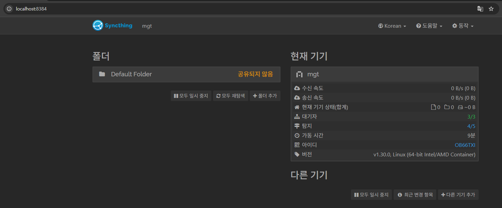
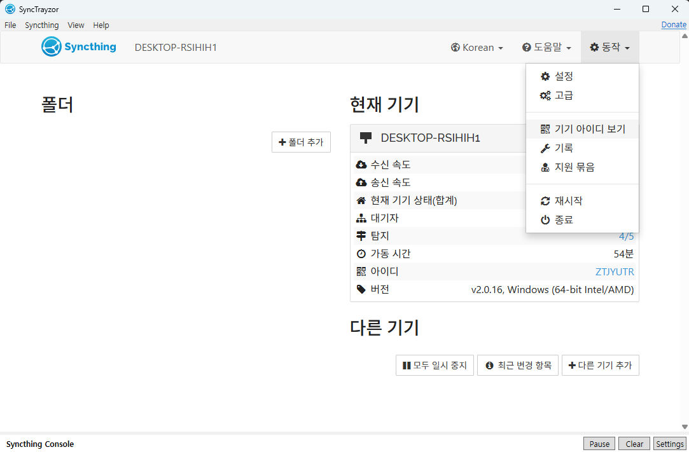
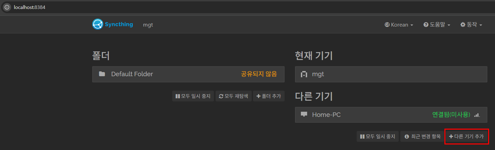
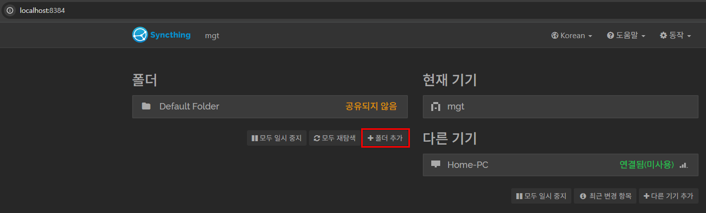
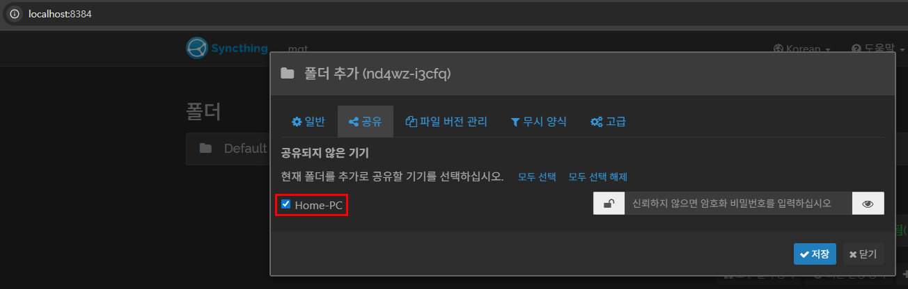

> Syncthing으로 홈서버 LXC ↔ Windows ↔ 모바일 vault 동기화
>

## 0. 구조

```
Windows (SyncTrayzor)
    ↕
mgt LXC (Syncthing, 허브) ← Claude Code가 직접 접근
    ↕
모바일 (Syncthing-Fork)
```

모든 기기가 mgt LXC를 허브로 동기화한다. LXC는 항상 켜져 있기 때문에 각 기기가 켜지는 순간 동기화된다.

## 1. LXC에 Syncthing 설치

Rocky Linux 9는 EPEL 저장소를 통해 설치한다.

```bash
dnf install -y epel-release
dnf install -y syncthing
systemctl enable --now syncthing@root
```

## 2. LXC Syncthing 웹 UI 접근

Syncthing 웹 UI는 기본적으로 `localhost:8384`에서만 열린다. SSH 포트 포워딩으로 로컬에서 접근한다.

```
ssh -L 8384:localhost:8384 mgt
```

브라우저에서 `http://localhost:8384` 접속



## 3. Windows에 SyncTrayzor 설치

SyncTrayzor는 Windows용 Syncthing 래퍼로, 트레이 아이콘으로 백그라운드 실행된다.

- 설치 후 `동작 → 기기 아이디 보기` 에서 Windows Device ID 확인



## 4. 기기 페어링

LXC 웹 UI에서 **다른 기기 추가** 클릭 → Windows Device ID 입력 → 저장



Windows SyncTrayzor에 수락 요청이 뜨면 수락한다.

## 5. 폴더 공유 설정

LXC 웹 UI에서 **폴더 추가** 클릭



- 일반 탭: 폴더 경로 입력 (`/root/obsidian`)
- 공유 탭: Windows 기기 체크



저장하면 Windows SyncTrayzor에 폴더 수락 요청이 뜬다. 수락 시 Windows vault 경로를 지정한다.

## 6. 모바일 연동

- Android: **Syncthing-Fork** 설치
- 동일하게 Device ID 교환 후 페어링
- 폴더 공유 설정에서 모바일 기기 추가 체크
- Obsidian 모바일에서 동기화된 폴더를 vault로 열기

